# Pattern: streaming payments

**Shape.** Bounded session per payer-payee pair. Pre-funded
capacity. A continuous stream of micro-payments or micro-receipts.
Deterministic close at session end.

## Why this fits Myelin

Streaming payments have a very specific shape:

```text
- one payer, one payee (or a small, fixed set)
- many micro-payments (one per second, minute, or hour)
- pre-funded capacity (the payer locks upfront)
- deterministic close (the total at session end is computed)
```

Myelin handles this naturally:

- **Bounded session** — exactly the right shape.
- **Many off-chain updates** — the fast path is built for this.
- **Pre-funded capacity** — the cell lock at session open is the
  mechanism.
- **Deterministic close** — the close CellTx computes the total.

The combination with [Fiber](../integrations/fiber.md) is
particularly natural: Fiber does the actual payment routing,
Myelin does the session bookkeeping and dispute resolution.

## The session shape

```text
session_id          -> payer || payee || start_ms
participants        -> [payer, payee]
escrow              -> capacity Cells locked by the payer
max_chunk_bytes     : ~32 KB (aggregated receipts)
max_cycles          : VM budget per accumulation script
session_duration    : minutes to days
```

## What a chunk looks like

Each chunk is an aggregation window. Inside:

```text
witness[0]          -> signature from the streaming-payments gateway
witness[1]          -> batch of receipts (per-second, per-minute, ...)
witness[2]          -> prior chunk's state root
witness[3]          -> nonce list per receipt source
```

The accumulation script:

1. Verifies the gateway signature.
2. Replays the receipt batch.
3. Verifies each receipt against the per-source nonce list.
4. Updates the running total in the session state.
5. Emits the execution report.

## Conflict domain keying

```text
conflict_key("stream/{payer}/{payee}/{session_id}/chunk/{index}")
```

This guarantees that two gateways cannot double-write the same
chunk, and that the same session cannot have two parallel
settlement paths.

## The deterministic close

At session end, the close CellTx computes:

```text
total_transferred = state_root_after.last_chunk.cumulative_total
fee               = total_transferred * fee_basis_points / 10000
net_to_payee      = total_transferred - fee
```

The close CellTx transfers `net_to_payee` capacity from the
escrow Cells to the payee and refunds the remainder to the payer.

```mermaid
%%{init: {
  "theme": "base",
  "themeVariables": {
    "primaryColor": "#EEF2FF",
    "primaryTextColor": "#1E293B",
    "primaryBorderColor": "#4F46E5",
    "lineColor": "#6366F1",
    "secondaryColor": "#E0E7FF",
    "tertiaryColor": "#C7D2FE"
  }
}}%%
flowchart LR
    A["Payer locks<br/>escrow Cells"]:::l1
    B["Myelin session open"]:::l2
    C["Chunk 0:<br/>receipt batch 1"]:::l2
    D["Chunk 1:<br/>receipt batch 2"]:::l2
    E["..."]:::l2
    F["Chunk N-1:<br/>final batch"]:::l2
    G["Settlement intent"]:::l2
    H["Settlement package"]:::l2
    I["L1 settlement tx<br/>(net to payee,<br/>refund to payer)"]:::l1

    A --> B --> C --> D --> E --> F --> G --> H --> I

    classDef l1 fill:#C7D2FE,stroke:#7C3AED,color:#1E293B;
    classDef l2 fill:#E0E7FF,stroke:#4F46E5,color:#1E293B;
```



## What a dispute looks like

A dispute in a streaming-payment session is usually one of:

| Dispute | What the court checks |
| --- | --- |
| **Receipt doesn't match the rule** | The receipt's amount is within the agreed per-unit bound. |
| **Stale receipt** | The receipt's timestamp is within the session window. |
| **Wrong source** | The receipt's source is in the agreed source set. |
| **Double-counted** | The receipt's nonce hasn't been seen before. |

Each one is a deterministic check. The court bundle replays the
chunk and verifies the state root.

## Combining with Fiber

When combined with [Fiber](../integrations/fiber.md), the pattern
becomes:

```text
Myelin session
  -> accumulator script runs off-chain
  -> chunk commits the running total
  -> bridge releases Fiber payment preimages
  -> close CellTx settles the aggregate
```

This gives you:

- **Audit trail** — every chunk is verifiable.
- **Dispute path** — any chunk is challengeable.
- **Atomicity** — Fiber payments settle when the Myelin session
  closes (or vice versa, via shared payment hash).

The bridge controller is the glue; see
[Fiber Network bridge](../integrations/fiber.md) for the
boundary details.

## A reference implementation sketch

```rust
fn build_streaming_chunk(
    session_id: [u8; 32],
    index: u64,
    receipt_batch: Vec<u8>,
    gateway_signature: [u8; 64],
    nonces: Vec<u8>,
) -> CellTx {
    CellTxBuilder::new()
        .witnesses(vec![
            gateway_signature.to_vec(),
            receipt_batch,
            prior_chunk_state_root(index),
            nonces,
        ])
        .cell_deps(vec![accumulator_script_dep()])
        .build()
        .expect("streaming payments chunk CellTx build")
}
```

The `accumulator_script_dep()` references the CellScript type
script that encodes the per-session accumulation rule (which
sources count, what the per-unit bound is, what the fee basis is).

## The honesty boundary

Myelin can produce:

- ✅ An accumulation script that runs deterministically.
- ✅ Per-chunk CellTx reports with projection status.
- ✅ A court bundle for any disputed chunk.
- ✅ A settlement package that closes the session on L1.

Myelin does **not** ship:

- The receipt-source integration (e.g. the per-second metering
  hook).
- The Fiber bridge implementation.
- The user-facing wallet.

If you have those, Myelin is the settlement layer. If you don't,
Myelin won't build them for you.

## Where this works best

Streaming payments with Myelin are best when:

- The session has a clear bounded duration (minutes to days).
- The per-unit amount is fixed or has a clear rule.
- The payee is willing to lock escrow capacity upfront.
- The dispute rule is simple enough to encode in a CellScript.

For more complex flows (variable amounts, multi-party, contingent
settlement), the pattern is similar but the accumulator script
gets correspondingly more complex.

## Where to go next

- [Pattern: IoT metering](iot-metering.md) — similar shape,
  different content.
- [Fiber Network bridge](../integrations/fiber.md) — the natural
  pairing.
- [Session lifecycle](../interactions/session-flow.md) — what a
  Myelin session actually is.