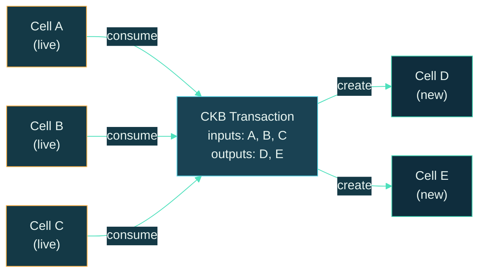
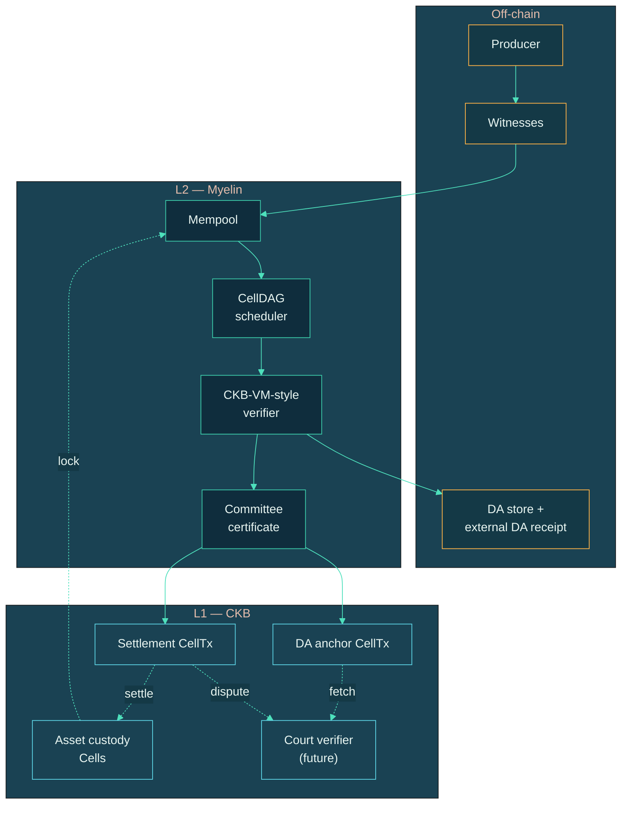
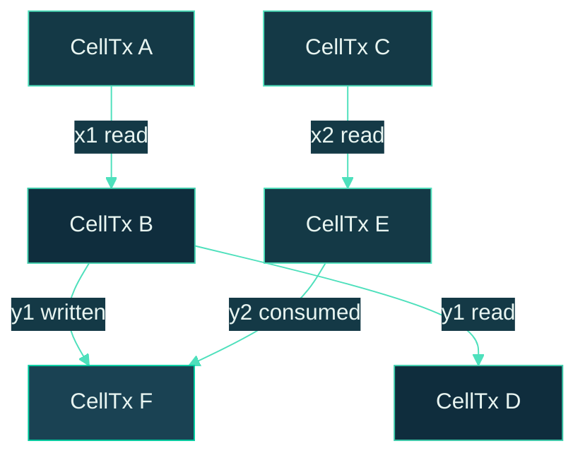
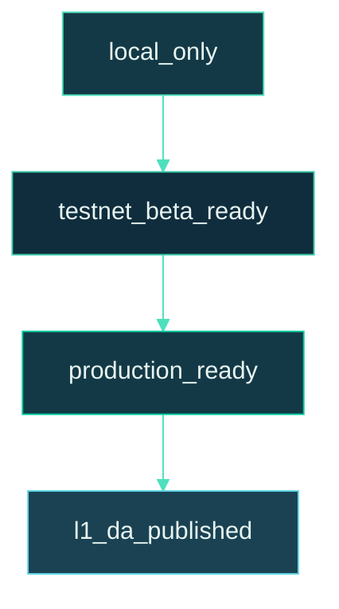
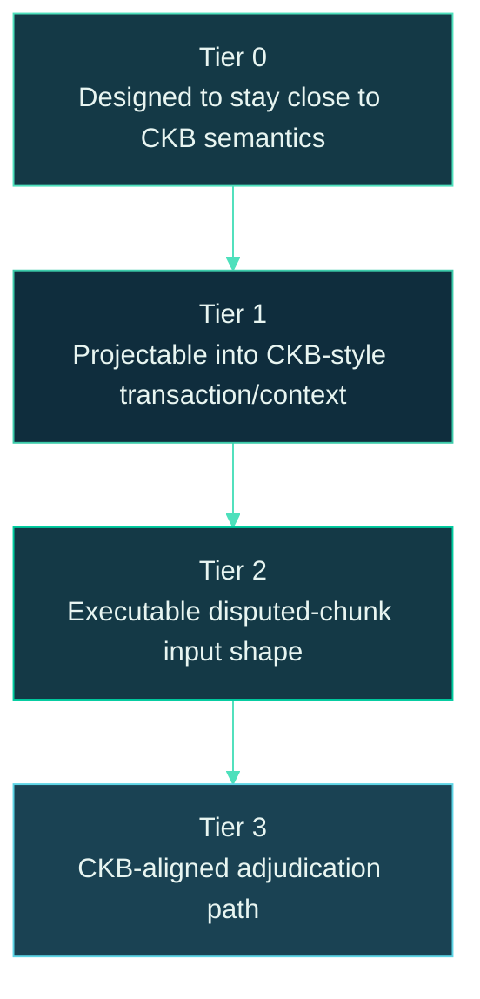
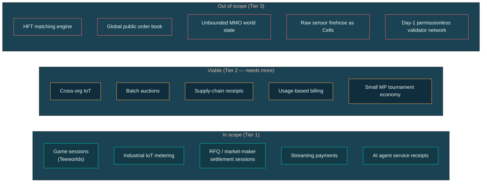
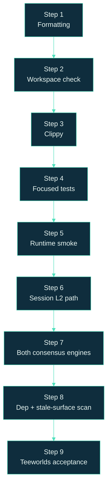

# Diagram gallery

A copy-paste-friendly collection of the mermaid diagrams used
throughout the Myelin documentation. Each diagram is shown with
its full source, including the CKB-teal/navy theme override, so
you can lift it directly into a slide deck or external doc.

> [!TIP]
> When you copy a diagram, **also copy the `%%{init:{...}}%%`
> block** at the top. Without it, the diagram will use mermaid's
> default theme instead of the CKB palette.

## 1 — Runtime spine (home page)

The full CellScript → CellTx → CellDAG → VM → state root →
evidence pipeline.

## 2 — Cell Model consumption / creation

How a CKB transaction consumes and creates Cells.

## 3 — Three-layer model

The complete L1 / L2 / off-chain picture.

## 4 — CellDAG with dependencies

How two CellTxs become dependent, conflicting, or parallel.

## 5 — DA ladder

The four readiness levels.

## 6 — Five-step readiness chain

Context → economics → inclusion → stability → finality.

## 7 — Claim ladder

The four-tier claim ladder.

## 8 — Use-case tiers

What's in scope, viable, and out of scope for Myelin.

## 9 — Session lifecycle timeline

Open → chunks → DA → settlement → L1 close.

```mermaid
%%{init: {
  "theme": "base",
  "themeVariables": {
    "primaryColor": "#0F2D3D",
    "primaryTextColor": "#E8F5F1",
    "primaryBorderColor": "#3CCBAA",
    "lineColor": "#4EE0BC",
    "secondaryColor": "#143946",
    "tertiaryColor": "#1A4253"
  }
}}%%
gantt
    title Session lifecycle
    dateFormat X
    axisFormat %s

    section L1 (CKB)
    Asset custody lock    :l1a, 0, 1
    Final settlement      :l1b, 14, 1

    section L2 (Myelin)
    Session open          :l2a, 1, 1
    Chunk 0 (fast path)   :l2b, 2, 3
    Chunk 1 (fast path)   :l2c, 5, 3
    Chunk 2 (fast path)   :l2d, 8, 3
    DA anchor package     :l2e, 11, 1
    Settlement intent     :l2f, 12, 1
    Settlement package    :l2g, 13, 1

    section Off-chain
    Witnesses             :offa, 0, 14
    DA store sealing      :offb, 2, 9
```

## 10 — Production gate pipeline

The nine-step production gate.

## Notes on re-use

- The CKB-teal/navy palette is defined in the
  `%%{init:{...}}%%` block. To use a different palette (e.g. for
  a darker presentation slide), only the colour values need to
  change.
- Mermaid's class definitions can override the theme variables
  per-node, which is how the layer-coloured diagrams work (orange
  for off-chain, teal for L2, cyan for L1).
- Sequence diagrams and gantt charts use the same theme variables
  but render with their own layout engine.