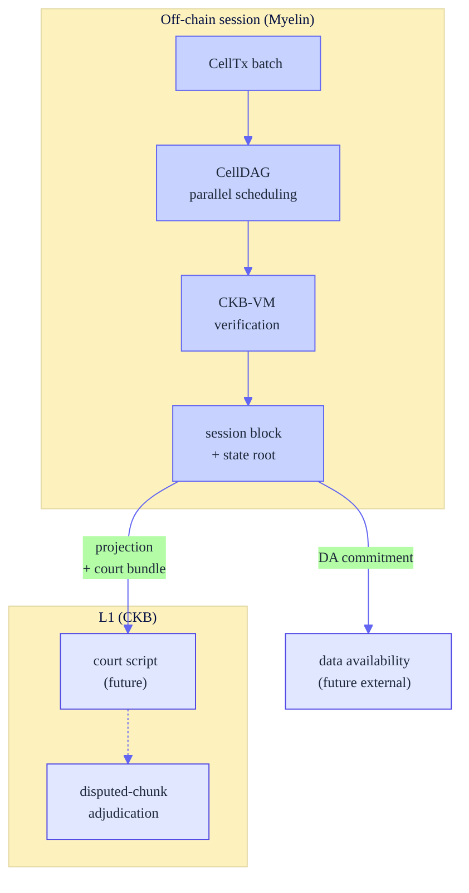
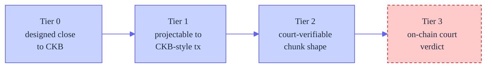

# Introducing Myelin: a CKB-aligned off-chain Cell session runtime

> **Draft Nervos Talk post.** This is the long-form introduction to Myelin —
> what it is, why I built it, how it works, what ships today, and where it is
> going. It is the canonical narrative; the README is the one-screen index.

---

## Myelin in one paragraph

[Myelin](https://github.com/Myelin-Network/Myelin) is an off-chain Cell
session runtime. It runs high-throughput, finite state transitions outside
CKB while keeping every transition projectable back to a CKB-style
transaction. It schedules independent chunks in parallel, wraps a batch of
CKB-VM-verified chunks into a finalised session block, and emits a
self-contained court bundle for any disputed chunk — so a future on-chain
verifier can adjudicate a single chunk without re-running the whole session.
The closed-validator fast path ships today as a prototype; the permissionless
path is the roadmap.

Myelin is **not** a CKB full node, not a new L1, and not a finished
permissionless L2. It is a protocol seed: the execution, state, evidence, and
session-finality pieces needed to test the shape of an off-chain Cell ledger.

## The problem

CKB-VM is powerful enough to run real, complex logic — not just token moves.
A single chunk of a real-time game, a metering window, or a settlement batch
can execute inside the VM and verify correctly. But a usable system is more
than one verified chunk. To turn "this chunk executed correctly" into "this
*session* is a finalised, contestable state transition with a path back to
L1," a layer above the chunk has to answer five questions:

- **Scheduling** — how do many chunks in a batch execute together, and which
  can run in parallel?
- **Finality** — when is a batch committed, and by whom?
- **Projection** — can each chunk be mapped to a CKB-style transaction?
- **Dispute** — if a chunk is wrong, what does a court re-run, and what is
  the input shape?
- **Data availability** — where does the evidence live?

I built Myelin to be that layer.

## The isomorphism principle: why I do not touch the VM

This is the single most important design decision in Myelin, and it shapes
everything else.

CKB uses the **Cell Model**, not an account model: a transaction consumes
live Cells and creates new Cells; state changes happen through Cell
replacement; Cells carry data, a lock script, and an optional type script;
scripts run in CKB-VM. Myelin follows that mental model exactly. It does not
hide session state inside an account-style contract, and it does not modify
CKB-VM. The VM is treated as a fixed oracle.

The reason is **isomorphism**. Because Myelin runs the same CKB-VM, with the
same RISC-V ISA, the same script semantics (`CkbStrict`), and the same
Molecule transaction serialisation as L1, a Myelin CellTx is *structurally
projectable* into a CKB transaction. Myelin's projection layer asks: can this
`CellTx` be serialised with the CKB Molecule transaction layout, and do its
script/witness assumptions match a CKB-strict profile? When the answer is
yes, the chunk is `ckb_compatible` — a future on-chain court verifier can
re-run the *same* bytes through the *same* VM and reach the *same* verdict.
Every host-side shortcut I add (a cache, a parallel scheduler, a different
finality engine) is transparent: it changes how Myelin reaches an answer, not
what the answer is. The VM result is the ground truth both off-chain and
on-chain.

If I changed the VM — added an opcode, relaxed a cycle limit, substituted a
different ISA — that isomorphism would break. A chunk that verifies under a
modified VM might not verify under CKB's, and the projection path would be
meaningless. So every optimisation in Myelin lives strictly on the host side:
scheduling, caching, finality, evidence packaging. The VM is the contract
that keeps off-chain and on-chain honest with each other.

Because it follows the Cell Model directly, a Myelin session can always
report five things about any transition:

- what Cells were consumed or created,
- which lock/type-script-like rules were checked,
- which VM/profile assumptions were used,
- whether the transition can be projected into a CKB-style context,
- and which evidence would be relevant during a dispute.

Official CKB references I build against:
[docs map](https://docs.nervos.org/llms.txt) ·
[Cell Model](https://docs.nervos.org/docs/ckb-fundamentals/cell-model) ·
[CKB-VM](https://docs.nervos.org/docs/ckb-fundamentals/ckb-vm).

## How Myelin works

```mermaid
%%{init: {
  "theme": "base",
  "themeVariables": {
    "primaryColor": "#A5B4FC",
    "primaryTextColor": "#1E293B",
    "primaryBorderColor": "#4F46E5",
    "lineColor": "#6366F1",
    "secondaryColor": "#C7D2FE",
    "tertiaryColor": "#C7D2FE",
    "fontFamily": "Inter, system-ui, sans-serif",
    "fontSize": "14px"
  },
  "flowchart": { "curve": "basis", "padding": 12 }
}}%%
flowchart LR
    A["CellScript source"]:::source
    B["typed-cell metadata<br/>+ VM artefact"]:::artefact
    C["CellTx<br/>(Myelin)"]:::tx
    D["CellDAG<br/>scheduler"]:::sched
    E["Deterministic<br/>VM verification"]:::vm
    F["Session Cell<br/>state root"]:::state
    G["Evidence bundle<br/>(projection · DA ·<br/>court · settle)"]:::evidence

    A --> B --> C --> D --> E --> F --> G
    F --> C

    classDef source   fill:#A5B4FC,stroke:#4F46E5,color:#1E293B;
    classDef artefact fill:#C7D2FE,stroke:#6366F1,color:#1E293B;
    classDef tx       fill:#C7D2FE,stroke:#4F46E5,color:#1E293B;
    classDef sched    fill:#C7D2FE,stroke:#6366F1,color:#1E293B;
    classDef vm       fill:#A5B4FC,stroke:#4F46E5,color:#1E293B;
    classDef state    fill:#C7D2FE,stroke:#6366F1,color:#1E293B;
    classDef evidence fill:#C7D2FE,stroke:#7C3AED,color:#1E293B;
```





Every box is a real crate in the workspace: `cellscript`, `myelin-exec`,
`myelin-state`, `myelin-mempool`, `myelin-consensus`, `myelin-cli`. Support
crates live under `core-utils/`, `crypto/`, and `math/`.

## What is in the repository

| Path | Role |
| --- | --- |
| `exec/` | Cell transactions, script verification, VM/syscall glue, scheduler witnesses, and **CellDAG** conflict scheduling. |
| `state/` | Live Cell state roots (incremental MuHash) and data-availability proof primitives. |
| `mempool/` | Cell transaction pool and deterministic conflict scoring. |
| `consensus/` | Static closed committee and Tendermint-style weighted precommit finality. |
| `cli/` | Command-line fixtures and report generation for CellTx, session, DA, settlement, and submission flows. |
| `cellscript/` | CellScript compiler, vendored in sync with upstream (0.21.1). The typed-cell model lives in `exec/`, not in a compiler fork. |
| `docs/` and `MYELIN_*.md` | Architecture notes, evidence reports, positioning, and rehearsal records. |
| `website/` | Marketing/docs landing site (Astro). |

## What I built

### 1. The typed-cell model

A Cell in CKB carries data, a lock script, and an optional type script. The
type script gives a Cell its *kind* — a token cell, an order cell, a
game-state cell. CKB verifies type scripts on chain, but the runtime has no
structured way to reason about "this is a typed cell of kind X, with these
conflict dimensions, this ownership, this mutability" before it hits the VM.

I added that layer. The **typed-cell model** is a runtime-side type system
that declares, for each type script, a `TypedCellDecl`: its ownership
(one-of-a-kind vs fungible), its mutability, and — critically — its
**conflict key** (`ConflictKeySpec`: by cell id, by field, by composite key,
or none). The conflict key is what lets the scheduler decide whether two
transactions touch the same state and must be ordered, or touch disjoint
state and can run in parallel.

This model is a Myelin-side development, branched from the CellScript line,
and it has **not** been merged back to the upstream CellScript compiler. The
division of labour is deliberate:

- **CellScript compiles, Myelin types.** The vendored `cellscript/` compiler
  is kept byte-for-byte in sync with upstream CellScript (currently 0.21.1;
  `scripts/check_cellscript_parent_parity.py` enforces this). It emits
  generic scheduler witnesses — a 9-field molecule carrying a per-access
  `binding_hash`. I did not fork the compiler to change that.
- The typed-cell runtime types (`TypedCellDecl`, `ConflictKeySpec`,
  `TypedCellStore`, `CellScriptSchedulerWitness`,
  `CellScriptSchedulerAccessWitness`, `compute_conflict_hash`) all live in
  Myelin's own `exec` crate (`exec/src/celltx/types.rs`), not in the
  compiler.
- A [witness bridge](https://github.com/Myelin-Network/Myelin/blob/main/exec/src/celltx/witness_bridge.rs)
  decodes the compiler's generic witness at runtime and recomputes Myelin's
  stronger `conflict_hash` / `typed_data_hash` from the transaction's
  concrete cells. The compiler cannot emit these directly because it does
  not know the deployed type-script identity at compile time — only the
  runtime does.

This boundary keeps the compiler upstream-clean and lets the typed-cell model
evolve at runtime speed. Whether it is proposed back upstream as a compiler
emission target is a separate, open decision.

### 2. Inter-transaction conflict scheduling (CellDAG)

Given typed cells with conflict keys, the **CellDAG** builds a read/write
dependency graph over the transactions in a session batch and schedules
independent transactions across Rayon topological layers. Two transactions
that read the same conflict domain stay in the same layer (parallel); a
read/write or write/write pair on the same domain creates a dependency edge
(serial). The conflict edges come from the typed-cell model, not just from
OutPoint-level input/output chaining — so the scheduler understands
*semantic* conflicts (two transactions touching the same logical resource),
not just structural ones.

### 3. Closed-validator finality with dual engines

A batch of verified chunks is wrapped into a `MyelinBlock` and finalised
under a pluggable committee: a static closed committee today, and a
Tendermint-style weighted-precommit verifier that is domain-separated and
tested alongside it. This is explicitly closed-validator (see
[the boundary](#what-myelin-does-not-claim)) — the session-finality layer a
benchmarking workload needs, not a permissionless consensus claim.

### 4. CKB-style projection and the court bundle

For each chunk, Myelin emits a projection report (is this chunk projectable
into a CKB-style transaction?) and, for a disputed chunk, a self-contained
**court bundle** that packages the witness layout, the molecule transaction,
the chunk data, and the committee finality evidence. The bundle passes 22
verification checks today. This is the input shape a future on-chain court
verifier would consume — the court script itself is not deployed yet, but
the bundle is real, the shape is fixed, and the path is documented end to end.

### 5. Data-availability evidence path

Myelin emits a DA manifest over sealed segments (Merkle-rooted, parallel leaf
hashing), with a replicated-committee availability layer and a hook for an
external DA receipt. The DA path is local-only today (no external provider),
but the commitment shape is in place.

## Optimisations — what each one buys, and why none touch the VM

Every optimisation below lives strictly on the host side. The VM is never
modified — this is not a limitation I work around but the isomorphism contract
described above. Each item states the effect it achieves.

### Already shipping

| Optimisation | What it achieves | Why it preserves isomorphism |
| --- | --- | --- |
| **CellDAG parallel inter-tx verification** (`exec/src/scheduler/executor.rs`) | Independent transactions in a batch verify concurrently across Rayon topological layers instead of serially. A session of *N* independent chunks finishes in `O(depth)` sequential verification rounds, not `O(N)`. | Scheduling changes *when* each transaction is verified, not *whether* it passes. Every transaction still runs through the unmodified CKB-VM verifier; the parallel layers run disjoint transactions at the same time. The union of results is identical to serial. |
| **Within-tx script-group parallelism** (`exec/src/vm/verifier.rs`) | The lock and type script groups *within one transaction* are verified in parallel (`script_groups.par_iter()`). A transaction with *K* script groups finishes in `O(1)` rounds instead of `O(K)`. | Same VM, same scripts, same cycle accounting — only the order of independent group evaluations changes. Cycle totals are summed deterministically. |
| **Incremental MuHash state root** (`state/src/cell_tree.rs`) | Each cell insert/remove updates the session state root in `O(1)` (a single 384-byte modular operation) instead of re-hashing the entire cell set. A session that commits thousands of cells pays no `O(n)` root cost per commit. | MuHash is an associative, order-independent accumulator; the root is identical whether computed incrementally or from scratch. The VM never sees the root computation — it is host-side accounting. |
| **Parallel DA Merkle leaf hashing** (`state/src/store/proof.rs`) | Sealing a 1 GB DA segment hashes its leaves in parallel (`par_chunks(2)` per Merkle level) instead of serially. Seal latency drops near-linearly with core count. | Merkle hashing is a pure, deterministic function; parallelising it yields a byte-identical root that the on-chain court would verify from the same leaves. |
| **Segment-reader lock release** (`state/src/store/segment.rs`) | The DA segment reader releases its file-handle cache lock *before* doing disk I/O (cloning the handle under the lock, reading outside it). One slow disk read no longer serialises all concurrent readers. | Pure host-side I/O scheduling; the bytes read are identical, only the locking discipline changes. |
| **Serialization cache** (`exec/src/serialization/cache.rs`) | A thread-safe LRU caches serialised bytes of versioned values, avoiding redundant re-serialisation of the same structures across a session. | The cached bytes are the exact Molecule encoding the VM and chain would see; caching avoids recomputing an identical byte string. |

### Planned (each with its specific effect)

| Optimisation | What it will achieve | Status |
| --- | --- | --- |
| **Mempool batch admission** | Admit a batch of transactions under one write lock, with conflict keys computed in parallel. Turns *N* serial `O(pool)` scans into one parallel pass plus one critical section, and closes a size-check race. | Planned (M) |
| **Sighash reused-values cache** | Fill the `NoCache` placeholder for CKB's `StandardSigHashReusedValues`, caching repeated sighash sub-computations across inputs of the same transaction. | Planned (M) |
| **Content-addressable VM-result cache** | Cache `(script_code_hash, args, inputs_hash) → (cycles, exit_code)` so re-verification of unchanged script groups (court replays, re-runs) is a lookup instead of a full VM run — the biggest throughput win for dispute workloads. | Planned (L) |
| **Parallel consensus signature verification** | Once real secp256k1/BLS replaces the current deterministic-blake3 stubs, verify committee precommit signatures in parallel. | Planned (waits on real crypto) |

None of the above changes a single VM instruction, cycle budget, or
serialisation rule. The off-chain path can be made as fast as host hardware
allows, without diverging from what the chain would verify. The full list is
maintained in the [concurrency & optimisation plan](https://github.com/Myelin-Network/Myelin/blob/main/docs/operations/concurrency-optimization-plan.md).

## Acknowledgements

Myelin stands on work that xuejie (Xuejie Xiao) did first, and I want to be
specific about that because the intellectual lineage matters.

His [*Teeworlds on CKB*](https://xuejie.space/2026_06_16_teeworlds_on_ckb/)
experiment proved a full multiplayer game tick loop runs inside CKB-VM —
including the RISC-V replayer binary, the fixture builder, and every layer of
in-VM optimisation (fixed-point math, custom collision detection, musl/libcxx
ports, libc stripping). Myelin reuses that binary unchanged; I did not write
a line of it. It is the most demanding publicly available CKB-VM workload, and
it is the reference pressure test Myelin runs against.

Three of his subsequent posts shaped how I designed the runtime, each by
exposing a design pressure the session layer must absorb:

- [*Fat transactions, thin transactions*](https://xuejie.space/2026_06_24_fat_transactions/)
  framed a transaction's witness, input/output, and data as independent
  expansion axes. That framing hardened my discipline of keeping scheduler
  policy in the witness axis and payload in the data axis.
- [*Porting One Hour One Life*](https://xuejie.space/2026_06_29_porting_one_hour_one_life_game_loop_to_ckb/)
  proved a persistent crafting world runs on CKB-VM and surfaced the need for
  a chained world-state hash across chunks. That directly informed my decision
  to make the session state root a first-class, incrementally computed
  commitment.
- [*Archipelagos*](https://xuejie.space/2026_06_30_archipelago/) explored
  sharding a world too large for one chunk into typed islands with a customs
  border. It reinforced that the typed-cell conflict-domain model I was
  building maps naturally onto multi-domain sessions, and it pushed me toward
  session-level composition evidence as a roadmap goal.

To state the line plainly: xuejie demonstrated what CKB-VM is capable of and,
in each post, pointed at the session-and-evidence layer as the next problem.
Myelin is my attempt at that layer. I reuse his replayer binary as the
reference workload; the runtime, the typed-cell model, the witness bridge, and
every host-side optimisation are my own work.

## From a single chunk to a session

xuejie's model is *one verified chunk*: a self-contained transaction that runs
a slice of computation in the VM and either passes or fails. That model is
deliberately complete at its own altitude — a chunk needs no external state
to adjudicate, which is what makes on-chain verification tractable. Myelin
takes that atomic unit and makes it the building block of a larger structure,
without weakening the atomicity a court relies on. The advance is not in the
VM or the chunk itself; it is in everything that sits between and above chunks
to turn a sequence of verified executions into a finalised, contestable
session.

Concretely, the model gains seven dimensions that the single-chunk
demonstration did not carry:

| Dimension | Single-chunk model | Myelin session model |
| --- | --- | --- |
| **Inter-chunk scheduling** | None — each chunk is verified in isolation. | CellDAG builds a typed read/write dependency graph and schedules independent chunks across parallel topological layers. |
| **State continuity** | A world-state hash is threaded manually across chunks. | An incremental MuHash accumulator (`CellStateTree`) maintains the session state root in `O(1)` per cell transition; every commit produces a `state_root_before → state_root_after` pair. |
| **Conflict reasoning** | `binding_hash` — a hash of the source-level variable name, carrying no type-script identity. | `ConflictKeySpec` + `compute_conflict_hash` bind the type-script identity into the conflict domain, so two transactions conflict iff they touch the same typed resource. |
| **Projection to L1** | Execution is the endpoint; no notion of "can this land on CKB?" | A projection report tests whether each chunk serialises to a valid CKB Molecule transaction under `CkbStrict` semantics, producing a `ckb_compatible` verdict per chunk. |
| **Dispute shape** | The chunk-in-one-tx philosophy (no bisection). | Adopted unchanged — but wrapped in a self-contained **court bundle** (22 verification checks) that packages the witness layout, molecule transaction, chunk data, and finality evidence a future on-chain verifier would consume. |
| **Finality** | One-shot execution; no notion of a committed block. | A batch of verified chunks is finalised into a `MyelinBlock` under a pluggable committee (static closed committee + Tendermint precommit, domain-separated). |
| **Data availability** | None. | Sealed Merkle segments with a replicated-committee availability layer and a hook for an external DA receipt. |

None of these dimensions modify the chunk itself or the VM that verifies it.
A future court still re-runs a single disputed chunk through the same CKB-VM,
exactly as xuejie's model prescribes. What changes is that the chunk now
exists inside a session that has been scheduled, state-rooted, projected,
finalised, and made data-available — the surrounding structure that turns a
verified execution into a usable off-chain state transition. That is the
layer he deferred, and it is the layer Myelin provides.

## The reference workload

The flagship workload runs a real CKB-VM binary through Myelin's verifier end
to end — xuejie's *Teeworlds on CKB* replayer, a RISC-V ELF that runs a full
multiplayer game tick loop. Myelin runs it through its own CKB-strict
verifier, chunks the game tape, projects each chunk to CKB, and produces a
court bundle. The measured run is fully reproducible from the
[runbook](https://github.com/Myelin-Network/Myelin/blob/main/docs/tutorials/teeworlds-end-to-end.md):
`tape_bytes: 2162`, `vm_cycles: 15,139,695`, `court_checks: 22`.

## Demos

Two runnable demos, from zero-dependency to the full reference workload:

| | Demo | What it shows | Needs |
| --- | --- | --- | --- |
| ① | **[First run](https://github.com/Myelin-Network/Myelin/blob/main/docs/getting-started/first-run.md)** | `CellTx → session open → commit → court bundle → DA manifest`, all local | Rust only |
| ② | **[Teeworlds end-to-end](https://github.com/Myelin-Network/Myelin/blob/main/docs/tutorials/teeworlds-end-to-end.md)** (flagship) | xuejie's CKB-VM replayer through Myelin's verifier, chunked, projected to CKB, court bundle (22 checks) | teeworlds fork + built replayer |

To see the **CellDAG + parallel VM verification** path in action, run
`session commit-multi` after the first-run demo (see the
[concurrency plan](https://github.com/Myelin-Network/Myelin/blob/main/docs/operations/concurrency-optimization-plan.md)).

## What ships today

- The full off-chain runtime spine: `CellTx`, CellDAG + parallel VM
  verification, incremental MuHash state root, mempool, dual-engine
  finality.
- The typed-cell model and the witness bridge: real compiler metadata drives
  typed conflict edges in the CellDAG.
- The reference workload running end to end (numbers above).
- A zero-dependency session demo
  ([first run](https://github.com/Myelin-Network/Myelin/blob/main/docs/getting-started/first-run.md)).
- A published [concurrency & optimisation plan](https://github.com/Myelin-Network/Myelin/blob/main/docs/operations/concurrency-optimization-plan.md)
  documenting every host-side optimisation and its effect.

## Roadmap

Two near-term directions, both internal to Myelin's architecture:

- **Per-participant state commitment.** Today a session commit rolls the full
  session state root. For workloads with many independent participants (a
  game with many players, an IoT batch with many gateways, a sharded order
  book), that is heavier than necessary: each participant's state could be
  committed and scheduled independently via its own typed conflict domain, so
  the CellDAG runs participant-local transitions in parallel without
  re-committing the whole world. The `CellTx` shape and `ConflictKeySpec`
  model already support scoping a conflict key to a single participant; the
  work is to make that a first-class, validated commit path. The generality
  of this problem — fine-grained state crossing a chunk boundary — was
  surfaced concretely by xuejie's [OHOL port](https://xuejie.space/2026_06_29_porting_one_hour_one_life_game_loop_to_ckb/),
  but the solution is my own design on top of the typed-cell substrate.

- **Session-level composition evidence.** When a session spans multiple typed
  domains (different type scripts with different logic and conflict rules),
  the interesting unit of audit is not a single chunk but the set of domains
  the session touched and the transitions between them. The typed-cell model
  already models each domain as a `TypedCellDecl` and schedules cross-domain
  transactions by conflict hash; the work is to aggregate that into a
  session-level manifest a court or auditor can read as a unit, at the same
  evidence tier as the single-chunk court bundle. The value of explicit
  domain-composition evidence was reinforced by xuejie's [Archipelagos post](https://xuejie.space/2026_06_30_archipelago/),
  but the manifest design and its court-visible shape are my own.

Both build on substrate Myelin already ships. Neither requires changing
CKB-VM, the `CellTx` shape, or the typed-cell model.

## What Myelin does **not** claim

This is a positioning statement, not a production-readiness claim.

- **Closed-validator finality only.** The committee is static and known.
  Permissionless validator entry is out of scope today. Static committee
  finality must not be marketed as permissionless L2 security.
- **No on-chain court yet.** The court bundle is the input shape for a future
  on-chain verifier; the verifier itself is not deployed
  (`l1_court_implemented: false`). Myelin sits at Tier 2 of the claim ladder
  (executable disputed-chunk input shape), not Tier 3 (exercised court).
- **No mainnet, no external DA, no custody.** All evidence today is
  fixture-backed or local-devnet-backed.
- **The typed-cell model is not in upstream CellScript.** It is a Myelin
  runtime-side development. Whether it is proposed back upstream as a
  compiler emission target is a separate, open decision.



## Quick Start

Prerequisites: a Rust toolchain (1.85+), Python 3, and optionally Node.js/npm
for the website.

```bash
# verify the workspace builds and tests pass
cargo check --locked --workspace --all-targets
cargo test --locked --workspace
cargo clippy --locked --workspace --all-targets -- -D warnings

# generate a simple CellTx report
cargo run -p myelin-cli -- celltx simple-report

# open a deterministic session, commit a chunk, build + verify a court bundle
cargo run -p myelin-cli -- session open-fixture --consensus static-closed-committee --out /tmp/open.json
cargo run -p myelin-cli -- session commit-fixture --session /tmp/open.json --out /tmp/commit.json
cargo run -p myelin-cli -- session court-bundle --commit /tmp/commit.json --chunk-index 0 --out /tmp/court.json
cargo run -p myelin-cli -- session verify-court-bundle --bundle /tmp/court.json --out /tmp/court-verify.json
```

The full local production gate (broad; includes the Teeworlds acceptance gate
when the teeworlds checkout is present):

```bash
scripts/myelin_production_gate.sh
```

For the flagship workload, the
[teeworlds end-to-end runbook](https://github.com/Myelin-Network/Myelin/blob/main/docs/tutorials/teeworlds-end-to-end.md)
builds the RISC-V replayer and runs it through Myelin end to end.

## Evidence & reports

When reviewing the protocol state, start with these documents:

- `MYELIN_PRODUCTION_GATE.md` · `MYELIN_PRODUCTION_REHEARSAL_REPORT.md`
- `MYELIN_TEEWORLDS_REPRODUCIBILITY.md` · `MYELIN_USE_CASE_POSITIONING.md`
- `docs/MYELIN_ARCHITECTURE.md` · `docs/TEEWORLDS_FIXTURE.md`
- [Claim ladder](https://github.com/Myelin-Network/Myelin/blob/main/docs/security/claim-ladder.md)
- [Concurrency & optimisation plan](https://github.com/Myelin-Network/Myelin/blob/main/docs/operations/concurrency-optimization-plan.md)

For CellScript upstream parity:

```bash
scripts/check_cellscript_parent_parity.py
```

It compares the vendored `cellscript/` tree against the parent `../CellScript`
checkout, including nested CellScript repositories that Myelin vendors as flat
directories.

## Development notes

- Keep CKB-related claims aligned with the [official CKB docs](https://docs.nervos.org/llms.txt).
- Prefer `ckb-compatible` evidence for public demos.
- Do **not** describe closed-validator fast paths as permissionless L2 security.
- Keep generated reports out of commits unless they are intentional evidence
  artefacts.
- Keep `cellscript/` changes auditable against the parent checkout.

---

*Myelin is MIT-licensed and open source. I welcome discussions and
contributions on [GitHub](https://github.com/Myelin-Network/Myelin).*
