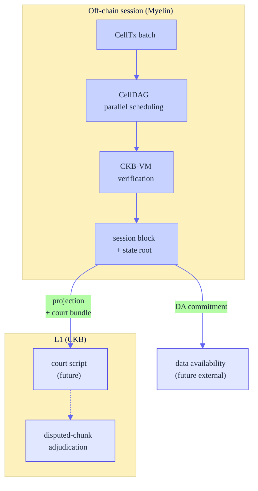
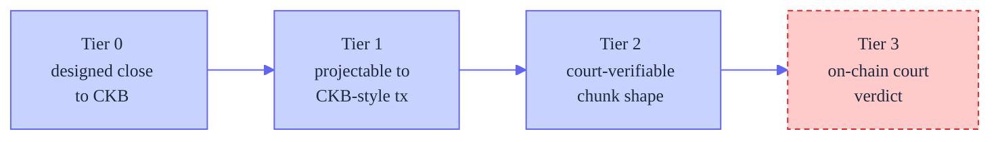

# Introducing Myelin: a CKB-aligned off-chain Cell session runtime

> **Draft Nervos Talk post.** The canonical public introduction to Myelin:
> what it is, the problem it solves, how it works, what it ships today, what
> it does not claim, and what comes next. This post supersedes the README as
> the long-form narrative; the README remains the one-screen index.

---

## Myelin in one paragraph

[Myelin](https://github.com/Myelin-Network/Myelin) is an off-chain Cell
session runtime. It runs high-throughput, finite state transitions outside
CKB while keeping every transition projectable back to a CKB-style
transaction. It schedules independent chunks in parallel, wraps a batch of
CKB-VM-verified chunks into a finalised session block, and emits a
self-contained court bundle for any disputed chunk — so a future on-chain
verifier can adjudicate a single chunk without re-running the whole session.
The closed-validator fast path ships today as a prototype; the permissionless
path is the roadmap.

Myelin is **not** a CKB full node, not a new L1, and not a finished
permissionless L2. It is a protocol seed: it keeps the execution, state,
evidence, and session-finality pieces needed to test the shape of an
off-chain Cell ledger.

## The problem

CKB-VM is powerful enough to run real, complex logic — not just token moves.
A single chunk of a real-time game, a metering window, or a settlement batch
can execute inside the VM and verify correctly. But a usable system is more
than one verified chunk. To turn "this chunk executed correctly" into "this
*session* is a finalised, contestable state transition with a path back to
L1," you need a layer above the chunk that can answer five questions:

- **Scheduling** — how do many chunks in a batch execute together, and which
  can run in parallel?
- **Finality** — when is a batch committed, and by whom?
- **Projection** — can each chunk be mapped to a CKB-style transaction?
- **Dispute** — if a chunk is wrong, what does a court re-run, and what is
  the input shape?
- **Data availability** — where does the evidence live?

Myelin is that layer. It treats off-chain execution as a finite Cell session
that can always answer those five questions.

## The isomorphism principle: why we do not touch the VM

This is the single most important design decision in Myelin, and it shapes
everything else.

CKB uses the **Cell Model**, not an account model: a transaction consumes
live Cells and creates new Cells; state changes happen through Cell
replacement; Cells carry data, a lock script, and an optional type script;
scripts run in CKB-VM. Myelin follows that mental model exactly. It does not
hide session state inside an account-style contract, and it does **not**
modify CKB-VM. The VM is treated as a fixed oracle.

The reason is **isomorphism**. Because Myelin runs the same CKB-VM, with the
same RISC-V ISA, the same script semantics (`CkbStrict`), and the same
Molecule transaction serialisation as L1, a Myelin CellTx is *structurally
projectable* into a CKB transaction. Concretely, Myelin's projection layer
asks: can this `CellTx` be serialised with the CKB Molecule transaction
layout, and do its script/witness assumptions match a CKB-strict profile?
When the answer is yes, the chunk is `ckb_compatible` — a future on-chain
court verifier can re-run the *same* bytes through the *same* VM and reach
the *same* verdict. When Myelin invents a host-side shortcut (a cache, a
parallel scheduler, a different finality engine), that shortcut is
*transparent*: it changes how Myelin reaches an answer, not what the answer
is. The VM result is the ground truth both off-chain and on-chain.

If we changed the VM — added an opcode, relaxed a cycle limit, substituted a
different ISA — that isomorphism would break. A chunk that verifies under
Myelin's modified VM might not verify under CKB's, and the projection path
would be a lie. So every optimisation Myelin makes lives strictly on the
host side: scheduling, caching, finality, evidence packaging. The VM is the
contract that keeps off-chain and on-chain honest with each other.

## How Myelin works

```mermaid
%%{init: {
  "theme": "base",
  "themeVariables": {
    "primaryColor": "#A5B4FC",
    "primaryTextColor": "#1E293B",
    "primaryBorderColor": "#4F46E5",
    "lineColor": "#6366F1",
    "secondaryColor": "#C7D2FE",
    "tertiaryColor": "#C7D2FE",
    "fontFamily": "Inter, system-ui, sans-serif",
    "fontSize": "14px"
  },
  "flowchart": { "curve": "basis", "padding": 12 }
}}%%
flowchart LR
    A["CellScript source"]:::source
    B["typed-cell metadata<br/>+ VM artefact"]:::artefact
    C["CellTx<br/>(Myelin)"]:::tx
    D["CellDAG<br/>scheduler"]:::sched
    E["Deterministic<br/>VM verification"]:::vm
    F["Session Cell<br/>state root"]:::state
    G["Evidence bundle<br/>(projection · DA ·<br/>court · settle)"]:::evidence

    A --> B --> C --> D --> E --> F --> G
    F --> C

    classDef source   fill:#A5B4FC,stroke:#4F46E5,color:#1E293B;
    classDef artefact fill:#C7D2FE,stroke:#6366F1,color:#1E293B;
    classDef tx       fill:#C7D2FE,stroke:#4F46E5,color:#1E293B;
    classDef sched    fill:#C7D2FE,stroke:#6366F1,color:#1E293B;
    classDef vm       fill:#A5B4FC,stroke:#4F46E5,color:#1E293B;
    classDef state    fill:#C7D2FE,stroke:#6366F1,color:#1E293B;
    classDef evidence fill:#C7D2FE,stroke:#7C3AED,color:#1E293B;
```





Every box is a real crate in the workspace: `cellscript`, `myelin-exec`,
`myelin-state`, `myelin-mempool`, `myelin-consensus`, `myelin-cli`.

## The five things Myelin contributes

### 1. The typed-cell model

A Cell in CKB carries data, a lock script, and an optional type script. The
type script is what gives a Cell its *kind* — a token cell, an order cell, a
game-state cell. CKB verifies type scripts on chain, but it does not give the
*runtime* a structured way to reason about "this is a typed cell of kind X,
with these conflict dimensions, this ownership, this mutability" before it
hits the VM.

Myelin adds that layer. The **typed-cell model** is a runtime-side type
system that declares, for each type script, a `TypedCellDecl`: its ownership
(one-of-a-kind vs fungible), its mutability, and — critically — its
**conflict key** (`ConflictKeySpec`: by cell id, by field, by composite key,
or none). The conflict key is what lets the scheduler decide whether two
transactions touch the same state and therefore must be ordered, or touch
disjoint state and can run in parallel.

This typed-cell model is **a Myelin-side development branched from the
CellScript line, and it has not been merged back to the upstream CellScript
compiler.** The division of labour is:

- **CellScript compiles, Myelin types.** The vendored `cellscript/` compiler
  is kept byte-for-byte in sync with upstream CellScript (currently 0.21.1;
  `scripts/check_cellscript_parent_parity.py` enforces this). It emits
  generic scheduler witnesses (a 9-field molecule with a per-access
  `binding_hash`). Myelin does not fork the compiler to change that.
- The typed-cell runtime types — `TypedCellDecl`, `ConflictKeySpec`,
  `TypedCellStore`, `CellScriptSchedulerWitness`,
  `CellScriptSchedulerAccessWitness`, `compute_conflict_hash` — all live in
  Myelin's own `exec` crate (`exec/src/celltx/types.rs`), not in the
  compiler.
- A [witness bridge](https://github.com/Myelin-Network/Myelin/blob/main/exec/src/celltx/witness_bridge.rs)
  decodes the compiler's generic witness at runtime and *recomputes* Myelin's
  stronger `conflict_hash` / `typed_data_hash` from the transaction's
  concrete cells. The compiler cannot emit these directly because it does not
  know the deployed type-script identity at compile time — only the runtime
  does.

This is an intentional boundary: it keeps the compiler upstream-clean and
lets the typed-cell model evolve at runtime speed. Whether the typed-cell
model is proposed back upstream as a compiler emission target is an open,
separate decision.

### 2. Inter-transaction conflict scheduling (CellDAG)

Given typed cells with conflict keys, Myelin's **CellDAG** builds a
read/write dependency graph over the transactions in a session batch and
schedules independent transactions across Rayon topological layers. Two
transactions that read the same conflict domain stay in the same layer
(parallel); a read/write or write/write pair on the same domain creates a
dependency edge (serial). The conflict edges come from the typed-cell model
above, not just from OutPoint-level input/output chaining — so the scheduler
understands *semantic* conflicts (two txs touching the same logical resource),
not just structural ones.

### 3. Closed-validator finality with dual engines

Myelin wraps a batch of verified chunks into a `MyelinBlock` and finalises it
under a pluggable committee: a static closed committee today, and a
Tendermint-style weighted-precommit verifier that is domain-separated and
tested alongside it. This is explicitly **closed-validator** (see
[the boundary](#what-myelin-does-not-claim)) — the session-finality layer a
benchmarking workload needs, not a permissionless consensus claim.

### 4. CKB-style projection and the court bundle

For each chunk, Myelin emits a projection report (is this chunk projectable
into a CKB-style transaction?) and, for a disputed chunk, a self-contained
**court bundle** that packages the witness layout, the molecule transaction,
the chunk data, and the committee finality evidence. The bundle passes 22
verification checks today. This is the input shape a future on-chain court
verifier would consume — the court script itself is not deployed yet, but
the bundle is real, the shape is fixed, and the path is documented end to end.

### 5. Data-availability evidence path

Myelin emits a DA manifest over sealed segments (Merkle-rooted, parallel leaf
hashing), with a replicated-committee availability layer and a hook for an
external DA receipt. The DA path is local-only today (no external provider),
but the commitment shape is in place.

## Optimisations — what each one buys, and why none touch the VM

Every optimisation below lives strictly on the host side. The VM is never
modified. This is not a limitation we work around — it is the isomorphism
contract described above. Each item states *what effect it achieves*.

### Already shipping

| Optimisation | What it achieves | Why it preserves isomorphism |
| --- | --- | --- |
| **CellDAG parallel inter-tx verification** (`exec/src/scheduler/executor.rs`) | Independent transactions in a batch verify concurrently across Rayon topological layers instead of serially. This is the headline off-chain throughput win: a session of N independent chunks finishes in `O(depth)` sequential verification rounds, not `O(N)`. | Scheduling changes *when* each tx is verified, not *whether* it passes. Every tx still runs through the unmodified CKB-VM verifier; the parallel layers just run disjoint txs at the same time. The union of results is identical to serial. |
| **Within-tx script-group parallelism** (`exec/src/vm/verifier.rs`) | The lock and type script groups *within one transaction* are verified in parallel (`script_groups.par_iter()`). A tx with K script groups finishes in `O(1)` rounds instead of `O(K)`. | Same VM, same scripts, same cycle accounting — only the order of independent group evaluations is shuffled. Cycle totals are summed deterministically. |
| **Incremental MuHash state root** (`state/src/cell_tree.rs`) | Each cell insert/remove updates the session state root in `O(1)` (a single 384-byte modular operation), instead of re-hashing the entire cell set. A session that commits thousands of cells pays no `O(n)` root cost per commit. | MuHash is an associative, order-independent accumulator; the root is the same whether computed incrementally or from scratch. The VM never sees the root computation — it is host-side accounting. |
| **Parallel DA Merkle leaf hashing** (`state/src/store/proof.rs`) | Sealing a 1 GB DA segment hashes its leaves in parallel (`par_chunks(2)` per Merkle level) instead of serially. Seal latency drops near-linearly with core count. | Merkle hashing is a pure, deterministic function; parallelising it yields a byte-identical root. The on-chain court would verify the same root from the same leaves. |
| **Segment-reader lock release** (`state/src/store/segment.rs`) | The DA segment reader releases its file-handle cache lock *before* doing disk I/O (cloning the handle under the lock, reading outside it). One slow disk read no longer serialises all concurrent readers. | Pure host-side I/O scheduling; the bytes read are identical, only the locking discipline changes. |
| **Serialization cache** (`exec/src/serialization/cache.rs`) | A thread-safe LRU caches serialised bytes of versioned values, avoiding redundant re-serialisation of the same structures across a session. | The cached bytes are the exact Molecule encoding the VM/chain would see; caching avoids recomputing an identical byte string. |

### Planned (each with its specific effect)

| Optimisation | What it will achieve | Status |
| --- | --- | --- |
| **Mempool batch admission** | Admit a batch of txs under one write lock, with conflict keys computed in parallel. Turns `N` serial `O(pool)` scans into one parallel pass + one critical section, and closes a size-check race. | Planned (M) |
| **Sighash reused-values cache** | Fill the `NoCache` placeholder for CKB's `StandardSigHashReusedValues`, caching repeated sighash sub-computations across inputs of the same tx. | Planned (M) |
| **Content-addressable VM-result cache** | Cache `(script_code_hash, args, inputs_hash) → (cycles, exit_code)` so re-verification of unchanged script groups (court replays, re-runs) is a lookup instead of a full VM run. The biggest throughput win for dispute workloads. | Planned (L) |
| **Parallel consensus signature verification** | Once real secp256k1/BLS replaces the current deterministic-blake3 stubs, verify committee precommit signatures in parallel. | Planned (waits on real crypto) |

None of the above changes a single VM instruction, cycle budget, or
serialisation rule. That is the point: the off-chain path can be made as fast
as host hardware allows, *without* diverging from what the chain would
verify.

## The reference workload

The flagship workload is a real CKB-VM binary running through Myelin's
verifier end to end. We use xxuejie's *Teeworlds on CKB* replayer — a RISC-V
ELF that runs a full multiplayer game tick loop — as the reference pressure
test, because it is the most demanding publicly available CKB-VM workload.
Myelin runs that binary through its own CKB-strict verifier, chunks the game
tape, projects each chunk to CKB, and produces a court bundle. The measured
run is fully reproducible from the
[runbook](https://github.com/Myelin-Network/Myelin/blob/main/docs/tutorials/teeworlds-end-to-end.md):
`tape_bytes: 2162`, `vm_cycles: 15,139,695`, `court_checks: 22`.

The replayer binary and the in-VM optimisation work are xxuejie's; Myelin
reuses that artifact unchanged and builds the session runtime above it — the
scheduling, finality, projection, and dispute layer.

## What ships today

- The full off-chain runtime spine: `CellTx`, CellDAG + parallel VM
  verification, incremental MuHash state root, mempool, dual-engine
  finality.
- The typed-cell model and the witness bridge: real compiler metadata drives
  typed conflict edges in the CellDAG.
- The reference workload running end to end (numbers above).
- A zero-dependency session demo
  ([first run](https://github.com/Myelin-Network/Myelin/blob/main/docs/getting-started/first-run.md)):
  `CellTx → session open → commit → court bundle → DA manifest`, all local.
- A published [concurrency & optimisation plan](https://github.com/Myelin-Network/Myelin/blob/main/docs/operations/concurrency-optimization-plan.md)
  documenting every host-side optimisation and its effect.

## What informs the roadmap

Two design pressures have shaped what Myelin builds next, and both build on
typed cells:

- **Persistent worlds need a transit cell.** A crafting-style game (or a
  sharded order book, or a multi-tenant IoT batch) needs to carry a slice of
  state — one player, one shard — across a chunk boundary without
  re-committing the whole world. Myelin's `CellTx` and typed-cell model
  already support this; the near-term work is to name a first-class
  **transit-cell pattern**, validate it, and let the CellDAG schedule transit
  cells independently of the world-root commit.
- **Worlds that do not fit one chunk need typed islands.** When a workload
  spans multiple rule sets (different type scripts with different logic),
  each is an "island" with its own conflict domain, and cross-island movement
  flows through transit cells. Myelin's typed-cell model already models this
  — a `TypedCellDecl` per type script is an island, and the CellDAG already
  schedules by conflict domain. The medium-term work is a session-level
  **composition manifest** that records which typed domains a session touched
  and which outputs crossed borders, lifted to the same court-visible shape
  as the single-chunk bundle.

Neither requires changing CKB-VM, the `CellTx` shape, or the typed-cell
model. They are naming, validating, and aggregating patterns the runtime
already supports.

## What Myelin does **not** claim

This is a positioning statement, not a production-readiness claim.

- **Closed-validator finality only.** The committee is static and known.
  Permissionless validator entry is out of scope today. Static committee
  finality must not be marketed as permissionless L2 security.
- **No on-chain court yet.** The court bundle is the *input shape* for a
  future on-chain verifier; the verifier itself is not deployed
  (`l1_court_implemented: false`). Myelin sits at **Tier 2** of the claim
  ladder (executable disputed-chunk input shape), not Tier 3 (exercised
  court).
- **No mainnet, no external DA, no custody.** All evidence today is
  fixture-backed or local-devnet-backed.
- **The typed-cell model is not in upstream CellScript.** It is a Myelin
  runtime-side development. Whether it is proposed back upstream as a
  compiler emission target is an open, separate decision.



## Try it

The fastest path is the [first-run demo](https://github.com/Myelin-Network/Myelin/blob/main/docs/getting-started/first-run.md)
(Rust only):

```bash
cargo run -p myelin-cli -- celltx simple-report
cargo run -p myelin-cli -- session open-fixture --consensus static-closed-committee --out /tmp/open.json
cargo run -p myelin-cli -- session commit-fixture --session /tmp/open.json --out /tmp/commit.json
cargo run -p myelin-cli -- session court-bundle --commit /tmp/commit.json --chunk-index 0 --out /tmp/court.json
cargo run -p myelin-cli -- session verify-court-bundle --bundle /tmp/court.json --out /tmp/court-verify.json
```

For the flagship workload, the
[teeworlds end-to-end runbook](https://github.com/Myelin-Network/Myelin/blob/main/docs/tutorials/teeworlds-end-to-end.md)
builds the RISC-V replayer and runs it through Myelin end to end.

---

*Myelin is MIT-licensed and open source. Discussions and contributions are
welcome on [GitHub](https://github.com/Myelin-Network/Myelin).*
