```mermaid
%%{init: {
  "theme": "base",
  "themeVariables": {
    "primaryColor": "#A5B4FC",
    "primaryTextColor": "#1E293B",
    "primaryBorderColor": "#4F46E5",
    "lineColor": "#6366F1",
    "secondaryColor": "#C7D2FE",
    "tertiaryColor": "#C7D2FE",
    "fontFamily": "Inter, system-ui, sans-serif",
    "fontSize": "14px"
  },
  "flowchart": { "curve": "basis", "padding": 12 }
}}%%
flowchart LR
    A["CellScript source"]:::source
    B["typed-cell metadata<br/>+ VM artefact"]:::artefact
    C["CellTx<br/>(Myelin)"]:::tx
    D["CellDAG<br/>scheduler"]:::sched
    E["Deterministic<br/>VM verification"]:::vm
    F["Session Cell<br/>state root"]:::state
    G["Evidence bundle<br/>(projection · DA ·<br/>court · settle)"]:::evidence

    A --> B --> C --> D --> E --> F --> G
    F --> C

    classDef source   fill:#A5B4FC,stroke:#4F46E5,color:#1E293B;
    classDef artefact fill:#C7D2FE,stroke:#6366F1,color:#1E293B;
    classDef tx       fill:#C7D2FE,stroke:#4F46E5,color:#1E293B;
    classDef sched    fill:#C7D2FE,stroke:#6366F1,color:#1E293B;
    classDef vm       fill:#A5B4FC,stroke:#4F46E5,color:#1E293B;
    classDef state    fill:#C7D2FE,stroke:#6366F1,color:#1E293B;
    classDef evidence fill:#C7D2FE,stroke:#7C3AED,color:#1E293B;
```

# Introducing Myelin: a CKB-aligned off-chain Cell session runtime

> **Draft Nervos Talk post.** This is the canonical public introduction to
> Myelin. It states what Myelin is, what problem it solves, how it works, what
> it ships today, and what it does not claim. It stands on the foundation of
> xxuejie's CKB-VM game-loop experiments, which it credits and builds on.

---

## The one-paragraph version

[Myelin](https://github.com/Myelin-Network/Myelin) is an off-chain Cell
session runtime that runs high-throughput, finite state transitions outside
CKB while keeping every transition projectable back to a CKB-style
transaction. It wraps a batch of CKB-VM-verified chunks into a finalised
session block, schedules independent chunks in parallel, and emits a
self-contained court bundle for any disputed chunk — so a future on-chain
verifier can adjudicate a single chunk without re-running the whole session.
The closed-validator fast path is shipping today as a prototype; the
permissionless path is the roadmap.

## Why Myelin exists

CKB-VM is now powerful enough to run real, complex logic on chain — not just
token moves. xxuejie's experiments proved this across an entire spectrum of
generators:

- [*Teeworlds on CKB*](https://xuejie.space/2026_06_16_teeworlds_on_ckb/) —
  a 60 Hz multiplayer game's tick loop runs inside the VM as one chunk per
  transaction (~15.1M cycles/chunk).
- [*Fat transactions, thin transactions*](https://xuejie.space/2026_06_24_fat_transactions/) —
  a framework showing a transaction's witness, input/output, and data are
  independent expansion axes, and CKB is deliberately fat on data.
- [*Porting One Hour One Life*](https://xuejie.space/2026_06_29_porting_one_hour_one_life_game_loop_to_ckb/) —
  a persistent crafting world needs a world-state hash and a transit cell to
  cross chunk boundaries.
- [*Archipelagos*](https://xuejie.space/2026_06_30_archipelago/) — when a
  world does not fit in one chunk, shard it into typed islands linked by a
  customs border.

That body of work settled the *execution* question decisively: the VM can do
it. It also, in each post, pointed at the next layer and explicitly deferred
it — how do you schedule many chunks, finalise them into a block, dispute a
bad one, and project the result back to L1? That session-and-evidence layer
is what Myelin is. We do not re-prove the VM capability; we reuse xuejie's
replayer binary directly and build the runtime above it.

## What Myelin adds — the layer above a verified chunk

Every box on that spine is a real crate in the workspace. The five things
Myelin contributes, each building on the Cell-model foundation:

### 1. Inter-transaction conflict scheduling (CellDAG)

A single chunk-in-one-tx answers "did this chunk execute correctly?" It does
not answer "how do many independent chunks in a session batch execute
**together**, and which can run in parallel?" Myelin's CellDAG builds a
read/write dependency graph over the transactions in a batch and schedules
independent transactions across Rayon topological layers. This is the first
inter-transaction parallelism on top of the chunk model — turning xuejie's
atomic chunk into a *schedulable* unit.

### 2. CellScript compiler metadata drives the scheduler

CellScript (the compiler targeting the typed-cell profile) emits per-action
scheduler witnesses: effect class, parallelizable hint, estimated cycles, and
per-access conflict domains. Myelin consumes this metadata: a
[witness bridge](https://github.com/Myelin-Network/Myelin/blob/main/exec/src/celltx/witness_bridge.rs)
decodes the compiler's witness format and recomputes typed conflict hashes
from the transaction's concrete cells. So the CellDAG's parallel layers are
driven by real compiler analysis, not just OutPoint-level structure. This is
exactly the witness/data-axis discipline xuejie's *fat/thin* post argued for:
policy lives in the witness, payload lives in the data.

### 3. Closed-validator finality with dual engines

xuejie's demos were one-shot VM executions with no notion of a committed
block or a finality boundary. Myelin wraps a batch of verified chunks into a
`MyelinBlock` and finalises it under a pluggable committee: a static closed
committee today, and a Tendermint-style weighted-precommit verifier that is
domain-separated and tested alongside it. This is explicitly **closed-validator**
(see the [security boundary](#what-myelin-does-not-claim)) — the
session-finality layer a benchmarking workload needs, not a permissionless
consensus claim.

### 4. CKB-style projection and the court bundle

This is the connective tissue back to L1. For each chunk, Myelin emits a
projection report (is this chunk projectable into a CKB-style transaction?)
and, for a disputed chunk, a self-contained **court bundle** that packages
the witness layout, the molecule transaction, the chunk data, and the
committee finality evidence. The bundle passes 22 verification checks today.
This is the input shape a future on-chain court verifier would consume — the
court script itself is not deployed yet, but the bundle is real, the shape is
fixed, and the path is documented end to end.

### 5. Data-availability evidence path

Myelin emits a DA manifest over sealed segments (Merkle-rooted, parallel leaf
hashing), with a replicated-committee availability layer and a hook for an
external DA receipt. The DA path is local-only today (no external provider),
but the commitment shape is in place.

## The research line we are part of

Myelin is not an island. It is the next step in a research line that xuejie
opened, and each of his posts sharpened a different part of what Myelin needs
to be. Rather than restate his work, here is how each design pressure maps
onto Myelin's architecture — and what it added to our roadmap.

### From *fat/thin transactions* → witness-axis discipline

The [fat/thin framework](https://xuejie.space/2026_06_24_fat_transactions/)
showed that a transaction's weight has three independent axes — witness,
input/output, and data. Myelin's `CellTx` already separates all three
(mirroring CKB's shape, so it stays projectable). The discipline we adopted
from this: **anything a future court must read to decide a dispute lives in
the witness axis; the data axis stays clean for replay.** Our scheduler
witnesses (effect, conflict hash, parallelizable) ride in the witness, and
the witness bridge translates them without touching the payload.

### From *OHOL* → the transit-cell pattern (roadmap)

The [OHOL port](https://xuejie.space/2026_06_29_porting_one_hour_one_life_game_loop_to_ckb/)
proved that persistent worlds need a **world-state hash** chained across
chunks plus a **transit cell** that carries a slice of state (one player, one
shard) across a chunk boundary without re-committing the whole world. Myelin
already has the world-state hash (an incremental MuHash root, O(1) per op)
and the `prev_root → new_root` chunk chain. What OHOL exposed is a gap we are
now closing: a **first-class transit-cell pattern** — a declared, typed cell
scoped to a single participant, schedulable by the CellDAG independently of
the world-root commit. The CellTx shape and typed-cell profile already support
it; the work is to name, validate, and expose it. *(Near-term roadmap.)*

### From *Archipelagos* → typed-cell islands and composition manifests (roadmap)

[Archipelagos](https://xuejie.space/2026_06_30_archipelago/) answered "the
world does not fit in one chunk" by sharding into typed islands, each with
its own rule set and a customs border. This maps almost exactly onto Myelin's
typed-cell model: a `TypedCellDecl` per type script is an island,
`conflict_hash` + Read/Write `AccessMode` is the contested-resource model,
and lock-script verification is the customs gate. What we are borrowing is
the framing of **composition** — lifting the court bundle from a single
disputed chunk to a session-level *archipelago manifest* that records which
typed domains a session touched and which outputs crossed borders. The data
for this already flows through the scheduler witnesses; aggregating it is a
witness-axis, court-visible addition. *(Medium-term roadmap.)*

## What ships today

- The full off-chain runtime spine: CellTx, CellDAG + parallel VM
  verification, incremental MuHash state root, mempool, dual-engine
  finality.
- The teeworlds reference workload running end to end through Myelin's VM
  verifier: `tape_bytes: 2162`, `vm_cycles: 15,139,695`, `court_checks: 22`,
  all reproducible from the [runbook](https://github.com/Myelin-Network/Myelin/blob/main/docs/tutorials/teeworlds-end-to-end.md).
- A zero-dependency session demo
  ([first run](https://github.com/Myelin-Network/Myelin/blob/main/docs/getting-started/first-run.md)):
  CellTx → session open → commit → court bundle → DA manifest, all local.
- The cellscript witness bridge: real compiler metadata drives typed conflict
  edges in the CellDAG.
- A published [concurrency plan](https://github.com/Myelin-Network/Myelin/blob/main/docs/operations/concurrency-optimization-plan.md)
  for the remaining host-side optimisations.

## What Myelin does **not** claim

This is a positioning statement, not a production-readiness claim. The hard
boundaries:

- **Closed-validator finality only.** The committee is static and known.
  Permissionless validator entry is out of scope today. Static committee
  finality must not be marketed as permissionless L2 security.
- **No on-chain court yet.** The court bundle is the *input shape* for a
  future on-chain verifier; the verifier itself is not deployed
  (`l1_court_implemented: false`). Myelin sits at **Tier 2** of the claim
  ladder (executable disputed-chunk input shape), not Tier 3 (exercised
  court).
- **No mainnet, no external DA, no custody.** All evidence today is
  fixture-backed or local-devnet-backed.
- **No in-VM improvement over xuejie.** We reuse the replayer binary
  unchanged. Our work is host-side orchestration and evidence, not VM or
  program optimization.

## Try it

The fastest path is the [first-run demo](https://github.com/Myelin-Network/Myelin/blob/main/docs/getting-started/first-run.md)
(Rust only). For the flagship workload, the
[teeworlds end-to-end runbook](https://github.com/Myelin-Network/Myelin/blob/main/docs/tutorials/teeworlds-end-to-end.md)
clones xuejie's fork at a pinned commit, builds the RISC-V replayer, and runs
it through Myelin end to end. Every step is reproducible.

## Credit

The *Teeworlds on CKB* experiment, the RISC-V replayer, the fixture builder,
the fat/thin framework, the OHOL port, and the archipelago design are entirely
xxuejie's. Myelin builds on top of those artifacts and would not be possible
without them. This post exists to introduce Myelin and to make the lineage and
the roadmap explicit.

---

*Myelin is MIT-licensed and open source. Discussions and contributions are
welcome on [GitHub](https://github.com/Myelin-Network/Myelin).*
