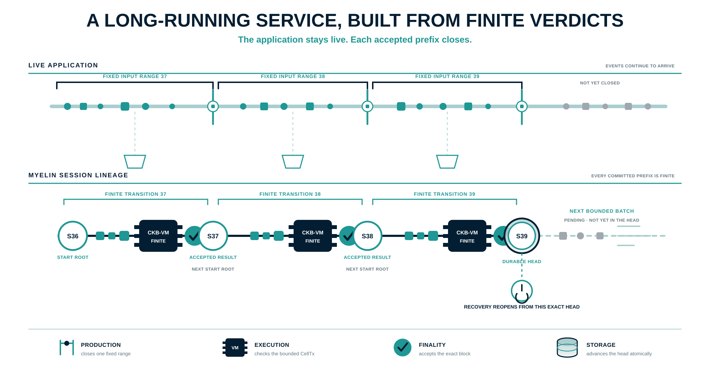
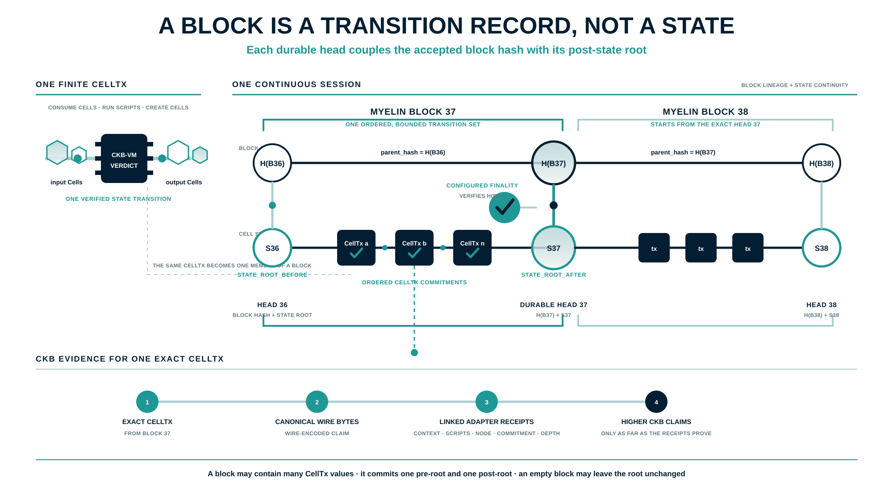
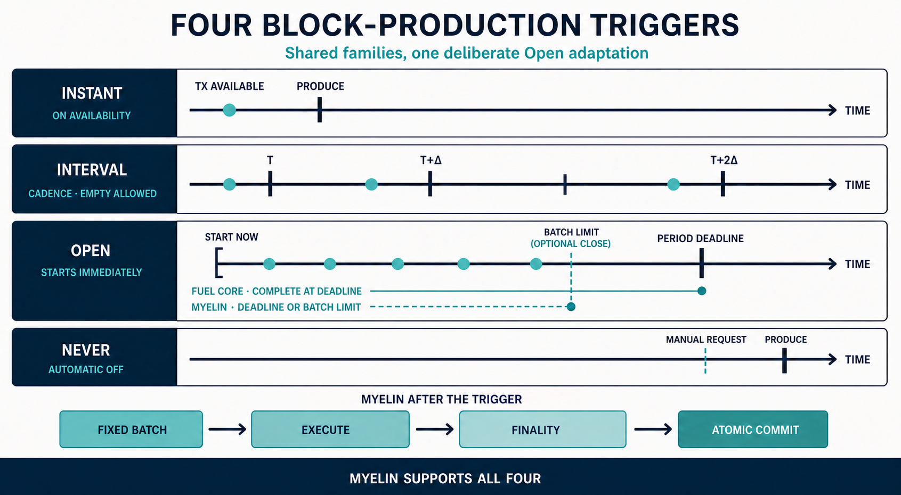
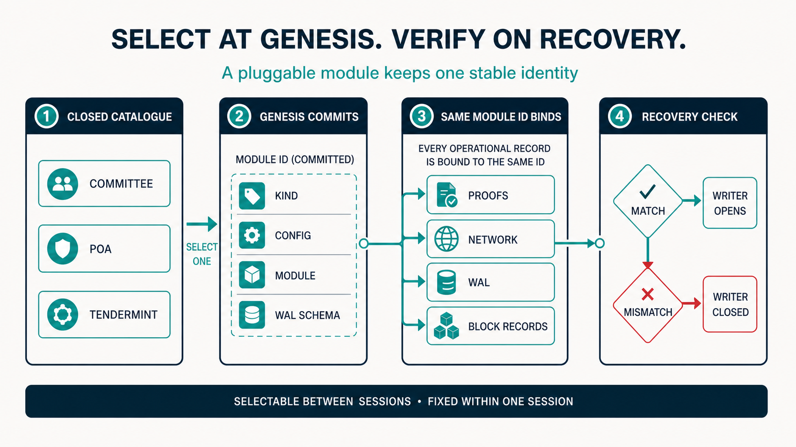
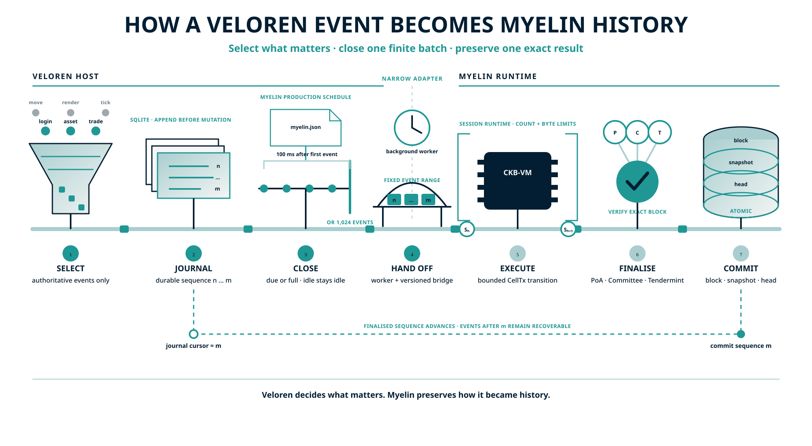
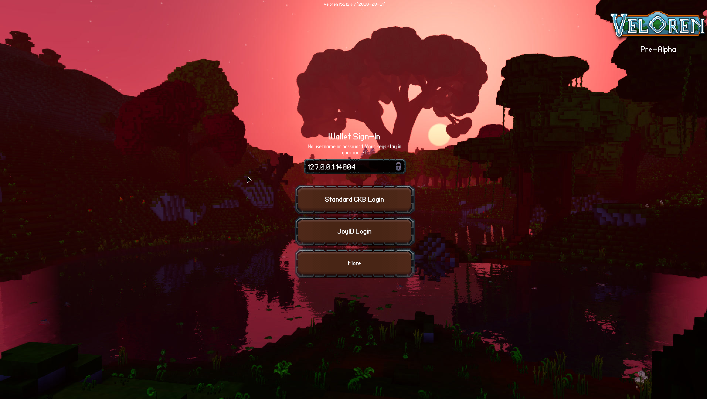

# From bounded sessions to continuous operation: pluggable chain modules in Myelin

The [previous post, ‘Introducing Myelin’](https://talk.nervos.org/t/introducing-myelin-a-ckb-aligned-off-chain-cell-session-runtime/10498) introduced the project: finite Cell transitions run off-chain while preserving CKB transaction and VM concepts, with an explicit evidence path for projection and bounded disputes. This post begins with the next problem.

At its execution boundary, Myelin remains an off-chain finite-Cell session runtime. A useful application may stay alive for hours, accept input many times a second and serve the same community for years. Its lifetime can be indefinite even though every transition must end.

Continuous operation therefore means composing an indefinite sequence of finite epochs. Each epoch starts from one durable finalised head, consumes a bounded range of work and advances the session only after deterministic execution and local finality verification succeed. The current runtime gives each session one writer and at most one candidate block in flight; the following epoch begins from the result that was actually committed.

A single transition can give us a verdict. Long-running operation needs a lineage of those verdicts.



_Each step stays finite. The service continues by carrying one verified result into the next step._

Here, ‘pluggable’ has a narrow meaning. Modules are compiled into a closed catalogue, selected when a session is created and committed into that session's genesis. There is no dynamic library loading, mid-session consensus swap or silent change of trust arrangement. ‘Myelin-finalised’ is equally specific: the genesis-bound closed-validator module has verified the result and the session store has committed it durably. It says nothing by itself about CKB inclusion or CKB finality.

## A long-lived world still advances in finite steps

[xuejie's Teeworlds experiment](https://xuejie.space/2026_06_16_teeworlds_on_ckb/) separated the deterministic game loop from graphics and networking, then replayed recorded player inputs inside CKB-VM. [One Hour One Life](https://xuejie.space/2026_06_29_porting_one_hour_one_life_game_loop_to_ckb/) carried the method into a world with no natural ending, using each minute's tape to advance one committed world-state hash to the next. [Archipelagos](https://xuejie.space/2026_06_30_archipelago/) added a spatial boundary, giving each region its own Cell-owned state while ports connected the wider world.

These experiments make the computational idea visible: a world may continue even though each replay ends. The harder service problem lives around each finite replay—when to close it, how to keep incoming work safe while finality runs, and where to resume after a crash.

## The pressure came from a live game

I recently joined Retric's discussion on [porting a Counter-Strike-style game to Fiber](https://talk.nervos.org/t/porting-couter-strike-to-fiber-network/10647/5). His [OpenStrike Fiber Arena](https://github.com/RetricSu/openstrike-fiber-arena) is a particularly useful engineering model because its boundaries are easy to see.

The authoritative server runs the game simulation at 64 ticks per second. Renet carries latency-sensitive inputs and snapshots. Fiber sits beside that hot path: before the match, the players authorise hold invoices; when the server records enough damage, it releases the corresponding preimage and the payment becomes claimable. With the default 25-damage bucket, four invoices cover one player's 100 HP. The matchmaker and game server never need the players' wallet keys or direct control of their Fiber nodes.

That division of labour matters. Renet remains the game transport, Fiber carries the payment authorisation, and the Myelin design explored below consumes an ordered journal asynchronously. CKB-VM execution never enters the 64 Hz tick loop. Myelin can bind and deterministically transform the server's committed verdicts; honest hit detection remains an application trust boundary unless the game also supplies independently verifiable inputs.

That is a strong baseline. The game remains responsive, payment is pre-authorised and the loser's refusal cannot undo damage that the server has already settled. It also gives the server considerable authority: the server decides which hit occurred and possesses the information that releases value. A bounded spending cap limits the blast radius, while production hardening still needs short-lived match keys, separation between simulation and settlement signing, an append-only event log and commitments that bind releases to a sequence and match state.

The more revealing pressure appears when a neat 1v1 demo becomes a service expected to run every day.

## A match contains more events than it first appears

In the same discussion, I looked at the aggregate figures published by [CS2 Tracker](https://www.cstracker.gg/): roughly 37 million matches, 748.6 million rounds and 5.4 billion kills at the time of the survey. The arithmetic is simple, and useful precisely because it gives an order of magnitude.

| From the published totals | Approximate result |
| --- | ---: |
| `748.6 million rounds ÷ 37 million matches` | `20.2 rounds per match` |
| `5.4 billion kills ÷ 37 million matches` | `146 kills per match` |
| `146 kills × four 25-HP buckets` | `584 threshold events per match` |

The last line is a deliberately rough planning model. Players do not always lose exactly 100 fresh HP before every kill, and a real damage stream contains its own edge cases. I use 584 as an application-event stress bound, rather than an estimate of concurrent Fiber invoices. It tells us that a production FPS match can create hundreds of economically interesting events without doing anything exotic. Finer buckets, healing or a different 5v5 ruleset can push the planning case beyond a thousand.

At that event rate, carrying bucket-by-bucket settlement literally into a longer-running service would charge rent in several places at once. Conditional-transfer slots remain occupied, liquidity stays reserved, the pre-match handshake grows, and cancellation, timeout and crash recovery become more complicated. An attacker also gains a cheap way to reserve scarce resources and abandon them. In a multiplayer game, pairwise channel and liquidity relationships add another dimension; a hub can simplify topology, though shared liability across several possible payees still needs an explicit model.

Retric's design made the hot-path separation concrete. The event survey changed the granularity I would choose for sustained operation.

From here, I am considering a different Myelin-facing settlement protocol. OpenStrike currently settles each configured damage bucket through its own hold invoice. In an epoch model, every participant would first pre-authorise or escrow a bounded maximum outbound exposure; the service could then collect a short interval of authoritative events and release only the final net amount after its checkpoint is finalised. If A inflicts 75 damage on B while B inflicts 50 on A, five gross 25-damage obligations reduce to one net obligation from B to A. Netting reduces settlement operations. The collateral or authorisation that makes settlement non-optional still has to exist before play.

A round boundary may be the natural checkpoint; a longer round can use a 10–30 second epoch. That epoch is bounded twice: computationally by event count, encoded bytes and VM cycle budgets, and economically by the maximum value authorised before it begins.

```text
64 Hz game hot path
  → signed, ordered event transcript
  → short epoch or round boundary
  → cumulative economic checkpoint
  → bounded net obligation
  → Fiber or CKB settlement path
```

Here, ‘economic checkpoint’ belongs to the application's vocabulary. A bridge encodes the record into deterministic Cell transitions; Myelin orders and executes those transitions, then commits the resulting block and state roots. The record still needs enough underlying data to be rebuilt: its sequence, previous checkpoint hash, gross debits and credits, net balances, consumed reservations, transcript commitment and expiry. A client, watchtower or replay service can then check conservation, detect a duplicate release and recover after a server restart. The server remains authoritative in the first trust profile; its history becomes bounded, reconstructible and auditable.

This is the bridge from finite execution to continuous operation. The game loop never waits for finality. Completed epochs enter Myelin asynchronously, one candidate at a time; each begins from the previous durable finalised root. If checkpointing falls behind, the system has an explicit choice—pause billable damage, continue without economic effects or end the match—before liability escapes its bound.

Long-running operation is therefore a chain of small, closed decisions. Production decides when an epoch is ready. Execution checks it. Finality accepts one exact result. Storage advances the durable head, and recovery proves that the next epoch really follows it. Those are the chain modules this post is about.



_A block records an ordered transition from one state root to the next. The durable head keeps the accepted block hash and its post-state root together._

## A receipt is a point; a session is a line

A verified chunk tells us that one transition reached the expected result. A running session has to preserve a longer sentence:

> Starting from this state, these transitions ran in this order, produced that state, were accepted under these rules, and can still be checked after a restart.

Think of the difference between checking one bank transfer and maintaining the ledger. The transfer carries its own validity. The ledger must also prevent a double spend, settle the order, survive a crash and retain enough history for another machine to audit it.

Myelin therefore keeps a session head. Each finalised block points to its parent and commits to the ordered Cell transactions, the state root before and after execution, scheduler and data commitments, and the selected finality mechanism. CKB-VM remains the judge of each Cell transition. The session machinery arranges valid transitions into a durable sequence and advances the head only after the exact block and proof have been verified.

Once that sequence existed, a second problem became visible. The first prototype could choose different finality engines, yet the choice had spread through the repository. The session knew concrete proof types. Storage knew their shapes. Networking knew Tendermint message names. Adding one engine could become a tour of the entire codebase.

The code had begun to tell on itself: knowledge was living in too many places.

## Modularity is about where knowledge lives

The newer design gives each layer a smaller vocabulary. The session asks a verifier to check one exact block and typed proof. A consensus module owns its proof and voting messages. The network authenticates and carries an opaque module message. RocksDB stores the resulting record and guards its identity. A small runtime host selects the compiled components and starts them in dependency order.

This is the practical meaning of a ‘pluggable chain module’ in Myelin. A different compiled-in implementation may be selected for a new session behind a narrow boundary, and its output is still checked locally. The Cell transition, its raw transaction identity and the CKB-VM result keep the same meaning as the machinery around them changes.

That design raised another, less obvious question. Consensus determines how operators accept a result. One earlier decision sits outside consensus: when has the current batch gathered enough work to become a result at all?

That question led me through FuelVM and into its host, Fuel Core.

## A useful detour through Fuel Core's production service

I began with FuelVM because execution was the obvious place to look. The useful seam appeared when I followed a transaction into Fuel Core: the VM decides what the transaction does, while a host service keeps the production clock. Once I saw that division in the full path from arrival to execution, sealing and import, Myelin's own boundary became much easier to name.

At Fuel Core revision [`b9d4d17`](https://github.com/FuelLabs/fuel-core/blob/b9d4d170da3a31c9ace5f963d633b326348e0d42/crates/services/consensus_module/poa/src/config.rs#L34-L47), its PoA producer defines four trigger policies. The easiest way to read them is to picture a shallow tray beside the producer. Transactions arrive and wait in the tray. The trigger has one small job: decide when that tray is ready to be handed on.

| Policy | Fuel Core | Myelin's adaptation |
| --- | --- | --- |
| `Instant` | a transaction arrival wakes block production | close one available, bounded selection immediately |
| `Interval` | attempt production on a fixed cadence | inspect the source on a fixed cadence; empty production is an explicit opt-in |
| `Open` | begin the period after the preceding production and attempt a block at its deadline | wait for the first transaction, then open a collection window; close at the deadline or a count/byte limit |
| `Never` | leave automatic production asleep while retaining requested production | retain manual production for a source-selected or exact caller-supplied batch |

`Instant` suits a session where latency is felt directly. In Myelin, the first available transaction wakes the producer, which takes one bounded selection and moves on. Work left behind can wake the next block in turn.

`Interval` behaves like a metronome. Myelin checks the source at each tick and skips an empty batch by default; a host that needs a heartbeat may opt into empty production explicitly.

`Open` deserves the distinction in the table. Fuel Core begins the next period after the preceding production. Myelin uses a lazy window for work that arrives in small bursts: the first available transaction starts the deadline, later arrivals can join it, and explicit count or byte limits may close the candidate early. An idle Myelin session opens no window and manufactures no empty history. The shared name marks the role; the timing differs deliberately.

`Never` simply leaves the automatic producer asleep. A caller may ask for one or more blocks when it is ready, or provide one exact ordered batch. That makes the policy valuable for deterministic replay, controlled tests and hosts that already own the clock.

The completed result still has more ground to cover. [Fuel Core seals the block and passes the execution changes to the importer](https://github.com/FuelLabs/fuel-core/blob/b9d4d170da3a31c9ace5f963d633b326348e0d42/crates/services/consensus_module/poa/src/service.rs#L376-L437), where commitment happens as a separate step.

Following that path gave me the division I wanted for Myelin: the trigger closes collection; execution checks the work; finality accepts the exact result; storage makes it durable.



_The trigger families correspond by role. Fuel Core starts the next `Open` period after production; Myelin waits for the first available transaction and may close its lazy window early at an explicit batch limit._

## Bringing those four rhythms into Myelin

That study led directly to a new module, `myelin-session-producer`. Myelin now carries the same four named trigger families, adapted to its own session model. The names describe the rhythm; every policy still hands over a finite, ordered batch with the same count and byte checks.

The word ‘reserves’ matters here. If a producer removes work before finality, a temporary signing failure can make valid transactions vanish. The new transaction-source interface keeps each selection in reserve while its candidate is in flight. After a durable head advance, the producer asks the source to acknowledge those reservations. A failed commit or an orderly shutdown releases them for a later attempt. The head commit and source acknowledgement are separate durability domains, so an acknowledgement failure is surfaced and the source adapter must reconcile before retrying.

Production is serialised through one writer, so an automatic tick and a manual request cannot race the same session head. The producer awaits the commit result before considering the next batch: one session has at most one candidate block in flight. It checks transaction count and encoded bytes before hand-off, and `myelin-session` checks them again while preparing the block. During an `Open` window, manual production remains unavailable; one live window means one comprehensible candidate.

The final hand-off is deliberately demanding. A `CandidateCommitter` receives a fixed vector and proposed timestamp. Its implementation must execute through the session, obtain the genesis-bound finality proof, verify that proof against the exact block, and advance the block, head, snapshot and outbox atomically. Only then does the producer receive a durable block height and hash.

The trigger controls the tempo. CKB-VM, finality and durable storage keep their own jobs. A controlled game session may choose `Instant` for responsiveness, a simulation may use `Open` for denser batches, and a replay harness may choose `Never` for exact control. Their transition rules remain unchanged.

## A plug still needs an identity

Production timing is an operational choice. Finality reaches deeper into the identity of a session, so Myelin treats its selection differently.

The current closed catalogue contains three compiled choices. A static committee accepts a configured weighted quorum over the same block. Proof of authority assigns each height to a known authority and depends on that signer being available. Tendermint moves a known validator set through proposal, prevote and precommit rounds until more than two thirds of the configured voting power reaches a decision. A common verifier interface does not make their safety and liveness assumptions equal.

These are three trust arrangements for controlled sessions, sharing one application-execution path. Their common contract requires the same transaction batch to produce the same raw transaction identities, scheduler commitment, execution order and before-and-after state roots. The production gate exercises that invariance across the built-in engines. A mismatch there is an execution-layer protocol failure. Only consensus-bound block and proof material may vary.

When a session is created, Myelin selects one module from the catalogue and commits the consensus kind, canonical validator or authority configuration, compiled module descriptor and WAL schema in genesis. Proofs, network envelopes, recovery logs and finalised records all lead back to that choice.



_Selection happens between sessions. Within one session, recovery expects the same module and configuration before the writer can reopen._

If a service restarts with another authority set or proof format, recovery refuses to reinterpret the old chain and keeps the writer closed. This is static registration with runtime selection. A Rust trait describes the socket; the genesis commitments identify what actually occupies it.

A session is immutable, though it need not be immortal. A service that runs for years will eventually need key rotation, a new operator set or a module upgrade. The safe direction is an explicit successor session: the old session finalises a handover checkpoint, and the new genesis binds that predecessor head together with its new module and configuration. That handover protocol remains future work; the current runtime keeps identity fixed for the life of a session.

## The driver moves; the verifier checks

The finality driver performs the active work. It chooses the scheduled PoA signer, gathers committee signatures or advances Tendermint rounds. The verifier has a calmer task: check the returned proof against the exact block, the module commitment and the validator configuration fixed for this session.

An application coordinator may say ‘success: true’; the session advances only after local proof verification. A dead coordinator can halt progress, which is a liveness failure. It gains no path around the verifier, which protects safety.

Continuous operation also depends on quieter modules. The network carries authenticated envelopes bound to the session, module commitment, sender, recipient, sequence and payload hash. It acknowledges a message after durable storage, accepts an exact retry idempotently, and treats different content at an accepted sequence as equivocation.

RocksDB commits the finalised block, durable head, current state checkpoint and outbox entries in one atomic operation. On restart, Myelin restores the latest checkpoint, audits the ordered block-and-proof lineage—parent hash, height, state roots, timestamp, module commitment and exact finality proof—then checks that the restored executor root equals the durable head. The writer opens only after those checks pass. Normal recovery does not re-execute every historical transaction; full historical replay remains a separate future audit mode.

Atomicity ends at the session store. Outbox delivery to an external game server or settlement adapter is at least once, and handlers must be idempotent on the deterministic message ID. Per-transition limits also leave one longer-horizon question: history and audit time still grow with the session. RocksDB already keeps a current checkpoint and only periodic archival snapshots, while pruning and checkpointed deep audit remain lifecycle work for truly long-lived deployments.

The runtime host brings storage and recovery up before the writer and consensus driver, closes the writer when a critical service fails, and shuts services down in reverse dependency order.

These modules rarely star in a demo because their success is quiet. Quiet is the point. They turn a convincing run into a service that can be left running.

## A shorter contract for the application

An application builder can now think in a more compact way. Supply deterministic Cell transitions and a transaction source. Choose a production rhythm and one known-operator finality arrangement. Connect the producer's commit port to the session driver. The producer chooses a bounded input range; the deterministic executor derives the resulting state change. Myelin keeps the chosen module identity, finalised history and evidence lineage together.

The boundaries also make future changes easier to judge. A fourth built-in finality engine should bring its own proof, message formats, catalogue entry, runtime wiring and tests. A new production rhythm should live in the producer. Either change should leave Cell execution, state resolution, generic networking and the CKB evidence adapter undisturbed.

The introductory post called a projection verdict `ckb_compatible`. That name carried too much implication. The implementation now uses a narrower evidence vocabulary: canonical CKB Molecule bytes and transaction hashes earn the `wire-encoded` stage. Context resolution, script verification, node acceptance, commitment and configured confirmation depth each require the linked `myelin-ckb-adapter` receipt chain for the exact transaction.

Myelin's scope remains an off-chain finite-Cell session runtime for controlled sessions and benchmarking. A session proof establishes finality under the operators recorded in that session's genesis. The machinery may vary between sessions; the history of a running session remains tied to the choices it began with.

For implementation details, see the [architecture overview](https://github.com/Myelin-Labs/Myelin/blob/main/docs/MYELIN_ARCHITECTURE.md), the [closed-validator finality documentation](https://github.com/Myelin-Labs/Myelin/blob/main/docs/architecture/consensus.md), and [ADR-009](https://github.com/Myelin-Labs/Myelin/blob/main/docs/explanation/architecture-decisions.md#adr-009-static-consensus-registration-with-genesis-locked-selection).

## An RPG-shaped experiment

I tested that shorter contract by adapting a fork of [Veloren](https://github.com/veloren/veloren) to Myelin. An RPG world's important events arrive unevenly and its history must survive restarts, making it a useful test for a long-running chain of finite transitions. The current fork follows a deliberately selective policy: only authoritative events with lasting game meaning, together with important asset changes, enter its durable Myelin journal. Movement, render frames, physics ticks and other transient activity stay in Veloren's ordinary hot path. This selectivity belongs to the Veloren adapter and this experiment; it is one operating choice among many that Myelin is built to accommodate.

The chosen producer policy decides when to close an epoch. In the current lazy `Open` profile, the first event starts a 100 ms window, 1,024 events close it early, and an idle world produces no blocks. At closure, Veloren fixes one sequence range and hands it to a background worker. The bridge may split that range into several bounded CellTx blocks; Myelin executes them through CKB-VM, verifies each configured finality proof and commits each result atomically in RocksDB. The next epoch waits until the worker returns the final durable head.

RocksDB and the SQLite journal remain separate durability domains. After Myelin commits, the bridge advances the application cursor and removes journal rows through that finalised sequence. A crash in the gap may leave already-committed rows in SQLite; recovery reads the cursor from the restored Myelin application state and reconciles the journal before new work proceeds. Events beyond that cursor remain pending.



_This Veloren profile chooses what matters to its state chain. Myelin closes finite batches and makes their history durable._

The split is deliberate. Veloren owns event meaning and wallet UX. In this experiment it chooses selected authoritative events, a lazy `Open` window, no empty blocks and an application-level event cap. Myelin keeps the other side of the boundary application-neutral: its producer consumes an adapter-supplied transaction source, supports `Instant`, `Interval`, `Open` and `Never` with manual production, offers explicit empty-interval production, and enforces configurable transaction-count and byte limits. Another host can choose a different event vocabulary and production rhythm while retaining the same finite CellTx, execution, proof-verification, atomic-storage and recovery contracts.

The state programme checks Cell continuity and commitments; Veloren's full game loop stays outside CKB-VM. Standard CKB and JoyID login keep keys with the wallet and give the server a short-lived proof bound to this deployment. Entering the Myelin state chain remains an off-chain session event; stronger CKB claims require the linked adapter receipts for the exact transaction.



_The Myelin-enabled Veloren client replaces the usual password prompt with standard CKB and JoyID wallet entry points._

I plan to keep using this ‘Veloren on Myelin’ fork as an experiment bed for RPGs: long-lived character state, inventory and trade flows, quiet and crowded production windows, wallet identity, recovery across many epochs, and eventually the boundaries of replay and court evidence. If games or CKB-isomorphic L2s interest you, please get in touch. I would be glad to compare workloads, work through an adapter, or discover together where this model needs to bend.
