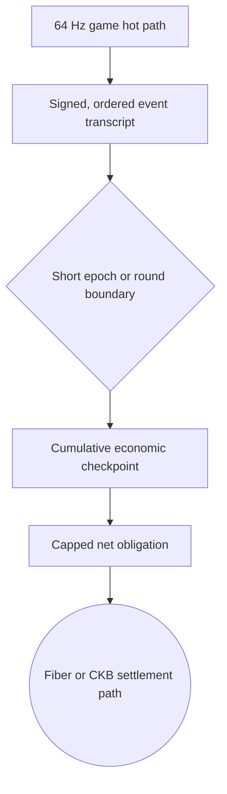
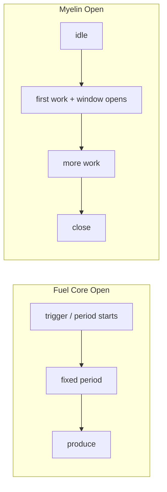
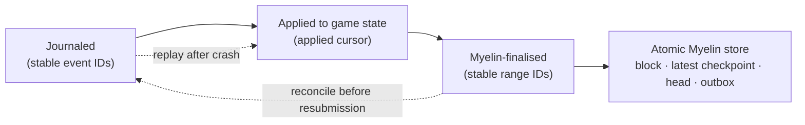

# From bounded sessions to continuous operation: pluggable chain modules in Myelin

> *Epoch production, genesis-bound finality, durable recovery, and a Veloren integration experiment.*

The previous post, [“Introducing Myelin: a CKB-aligned off-chain Cell session runtime”](https://talk.nervos.org/t/introducing-myelin-a-ckb-aligned-off-chain-cell-session-runtime/10498), described the core proposition: run finite Cell transitions off-chain, preserve CKB transaction and VM concepts, and retain an evidence path for projection and bounded disputes.

The next problem starts when an application stays alive for hours, accepts input many times a second, and serves the same community for years. Myelin began as a [xuejie-style](https://xuejie.space/2026_06_16_teeworlds_on_ckb/) finite-Cell session runtime. How can finite work support a service that feels continuous?

One execution cannot grow for ever. The service has to accept work, close inspectable pieces of history, survive a restart, and continue from the exact result it accepted last. A single transition gives us a verdict; long-running operation needs an ordered chain of them.

> **NOTE**
>
> In this post, **pluggable** means compiled in and selected at session creation, never hot-swapped. *Myelin-finalised* means accepted by the genesis-bound closed-validator module and durably stored. It does not mean finalised on CKB.

## A long-lived world still advances in finite steps

[xuejie’s Teeworlds experiment](https://xuejie.space/2026_06_16_teeworlds_on_ckb/) separated the deterministic game loop from graphics and networking, then replayed recorded player inputs inside CKB-VM. [One Hour One Life](https://xuejie.space/2026_06_29_porting_one_hour_one_life_game_loop_to_ckb/) carried the same method into a world with no natural ending: once a minute, a finite tape advanced one committed world-state hash to the next. [Archipelagos](https://xuejie.space/2026_06_30_archipelago/) added a spatial limit, with each region held in its own game Cell and ports connecting the wider world.

These experiments answer the computational part of the question. Continuity does not require endless execution. An operator still has to decide when to close each replay, keep incoming work safe while finality runs, and recover the accepted position after a crash.

## The pressure came from live gaming

I recently joined Retric’s discussion on [porting a Counter-Strike-style game to Fiber](https://talk.nervos.org/t/porting-couter-strike-to-fiber-network/10647/5). His [OpenStrike Fiber Arena](https://github.com/RetricSu/openstrike-fiber-arena) makes the engineering trade-offs easy to inspect.

The authoritative server runs the game simulation at 64 ticks per second. Renet carries latency-sensitive inputs and snapshots. Fiber sits beside that hot path: before the match, players authorise hold invoices; when the server records enough damage, it releases the corresponding preimage and the payment becomes claimable. With the default 25-damage bucket, four invoices cover one player’s 100 HP. The matchmaker and game server never need the players’ wallet keys or direct control of their Fiber nodes.

This gives the game a responsive hot path, pre-authorised payment, and protection against a loser refusing to pay after the server settles damage. It also gives the server considerable authority: the server decides which hit occurred and holds the information that releases value. A spending cap limits the damage from a compromised server. A production deployment would also need short-lived match keys, separate simulation and settlement signers, an append-only event log, and commitments that bind each release to a sequence and match state.

The harder scaling question appears when a tidy 1v1 demo becomes a daily service or a multiplayer session.

## A match contains more events than it first appears

In the same discussion, I looked at the aggregate figures published by [CS2 Tracker](https://www.cstracker.gg/): roughly 37 million matches, 748.6 million rounds, and 5.4 billion kills at the time of the survey.

| From the published totals | Approximate result |
| --- | ---: |
| `748.6 million rounds ÷ 37 million matches` | `20.2 rounds per match` |
| `5.4 billion kills ÷ 37 million matches` | `146 kills per match` |
| `146 kills × four 25-HP buckets` | `584 threshold events per match` |

The `584` figure is an **application-event stress bound**. It does not estimate concurrent Fiber TLCs or invoices. Players can enter a kill with less than 100 HP, yet the calculation still shows how quickly economically relevant events accumulate. Finer buckets, healing, or a different 5v5 ruleset can push the planning case beyond a thousand.

At that scale, pre-creating one hold invoice per event occupies conditional-transfer slots and reserves liquidity before play begins. It also enlarges the handshake and complicates cancellation, timeout, and crash recovery. An attacker can reserve scarce resources and abandon them. Multiplayer adds pairwise channel and liquidity relationships; a hub can simplify the topology, but shared liability across several possible payees still needs a defined rule.

I first tried to treat each damage event as a settlement event. The numbers became awkward very quickly. A better unit for sustained operation is a short epoch that records the cumulative result. If A inflicts 75 damage on B while B inflicts 50 on A, five gross 25-damage obligations reduce to one net obligation from B to A. A round boundary may provide the checkpoint; a long round can use a 10–30 second epoch.

This epoch model is a proposed extension of OpenStrike’s current hold-invoice design. It does not describe what OpenStrike ships today. Before an epoch opens, each participant must pre-authorise or escrow a capped maximum outbound exposure. Netting reduces settlement operations; it does not remove the authorisation or collateral that makes settlement non-optional. An epoch is capped twice: computationally by event, byte, and cycle limits, and economically by the maximum authorised loss.

The checkpoint carries a sequence, previous checkpoint hash, gross debits and credits, net balances, consumed reservations, transcript commitment, and expiry. A client, watchtower, or replay service can check conservation, reject a duplicate release, and recover after a server restart. The server stays authoritative in the first trust profile, while the journal makes its decisions reconstructible and auditable.

The game loop never waits for Myelin finality. Completed epochs may queue in the application journal up to a configured backlog cap, but Myelin prepares one session candidate at a time from the current durable head. The next candidate begins only after the previous one has been finalised and committed. If the journal reaches its cap, the application must pause billable damage, continue without economic effects, or end the match before exposure exceeds the authorised amount.

Production closes an epoch. Execution checks it. Finality accepts one exact result, and storage advances the durable head.

## A receipt is a point; a session is a line

A verified chunk tells us that one transition reached the expected result. A running session has to preserve a longer statement:

> Starting from this state, these transitions ran in this order, produced that state, were accepted under these rules, and can still be checked after a restart.

Checking one bank transfer differs from maintaining the ledger. The ledger has to prevent a double spend, settle order, survive a crash, and retain enough history for another machine to audit it.

Myelin keeps a session head. Each finalised block points to its parent and commits to the ordered Cell transactions, the state roots before and after execution, scheduler and data commitments, and the selected finality module. CKB-VM judges each Cell transition. The session advances its head only after verifying the exact block and proof.

The first prototype let operators choose among finality engines, but knowledge of each engine spread through the repository. The session knew concrete proof types, storage knew their shapes, and networking knew Tendermint message names. Adding an engine touched too many crates.

## Give each module a smaller vocabulary

The current design narrows what each layer knows. The session asks a verifier to check one exact block and typed proof. A consensus module owns its proof and voting messages. The network authenticates and carries an opaque module message. RocksDB stores the accepted record. A small runtime host selects compiled components and starts them in dependency order.

In Myelin, *pluggable chain module* has a narrow meaning. A new session may select another compiled-in implementation, and the runtime still verifies its output locally. The raw transaction ID and CKB-VM result do not change when an operator selects another finality module.

Consensus answers how operators accept a result. The producer answers an earlier question: when has the current batch collected enough work?

## A useful detour through Fuel Core’s block-production service

I began with FuelVM because execution looked like the obvious place to study. Following a transaction through [Fuel Core](https://github.com/FuelLabs/fuel-core) exposed the useful seam: FuelVM determines what the transaction does, while Fuel Core decides when block production starts and passes executed changes towards import.

At the source revision I studied, [Fuel Core’s PoA producer defines four trigger policies](https://github.com/FuelLabs/fuel-core/blob/b9d4d170da3a31c9ace5f963d633b326348e0d42/crates/services/consensus_module/poa/src/config.rs#L34-L47). The names provide a useful trigger vocabulary, although Myelin gives `Open` application-specific semantics: its accumulation window starts with the first available work and may close early at a count or byte limit.

| Policy | Fuel Core | Myelin’s adaptation |
| --- | --- | --- |
| `Instant` | a transaction arrival wakes production | reserve one available, capped selection immediately |
| `Interval` | attempt production on a fixed cadence | inspect the source on each tick; empty production requires operator opt-in |
| `Open` | start the next fixed period after production | stay idle until first work, then collect until the deadline or a count/byte cap |
| `Never` | disable automatic production while retaining requested production | produce only for a manual source selection or exact caller-supplied batch |

`Instant` favours response time and usually creates smaller batches. `Interval` checks the source on a fixed cadence and skips empty batches unless the operator enables them. `Open` waits for the first available transaction, reserves it, and opens the collection window at that moment. Later arrivals can join; a full candidate closes early. `Never` leaves timing to a caller, which suits deterministic replay, controlled tests, and hosts that already own the clock.

[Fuel Core seals the block and passes execution changes to the importer](https://github.com/FuelLabs/fuel-core/blob/b9d4d170da3a31c9ace5f963d633b326348e0d42/crates/services/consensus_module/poa/src/service.rs#L376-L437), where commitment happens in a separate step. That path gave Myelin a useful division of labour: the trigger closes collection, execution checks the work, finality accepts the result, and storage commits it.

## Bringing those four rhythms into Myelin

The study led to `myelin-session-producer`. Every policy hands over a finite, ordered batch under the same count and byte checks.

Reservations keep valid work safe during finality. The transaction source does not remove a selected item from its queue; it reserves the selection while one candidate is in flight. After the head advances atomically, the producer asks the source to acknowledge those reservations. If acknowledgement fails, the source adapter must reconcile before retrying. A failed commit or orderly shutdown releases the reservation for another attempt.

One writer serialises automatic and manual production. It waits for the commit result before selecting the next batch, so one session has at most one candidate block in flight. The producer checks transaction count and encoded bytes before hand-off, and `myelin-session` checks them again while preparing the block. A manual request is rejected while an `Open` window is collecting work.

A `CandidateCommitter` receives a fixed vector and proposed timestamp. It must execute through the session, obtain a genesis-bound finality proof, verify that proof against the exact block, and atomically advance the block, latest checkpoint, head, and outbox. Only then does the producer receive a durable block height and hash.

The trigger controls timing. CKB-VM, finality, and storage keep their own checks. A game may choose `Instant`, a bursty simulation may choose `Open`, and a replay harness may choose `Never`; all three execute the same Cell transitions.

## Genesis fixes the finality module

The closed catalogue currently contains three compiled choices. A static committee accepts a configured weighted quorum over one block. Proof of authority assigns each height to a known authority and depends on that signer being available. Tendermint advances a known validator set through proposal, prevote, and precommit rounds until more than two thirds of configured voting power decides.

All three use the same application-execution path, but they carry different safety and liveness assumptions. Given the same transaction batch, the cross-module tests require them to agree on raw transaction IDs, scheduler commitment, execution order, and before-and-after state roots. Only consensus-bound block and proof material may differ.

At session creation, genesis commits the consensus kind, canonical validator or authority configuration, compiled module descriptor, and WAL schema. Proofs, network envelopes, recovery records, and finalised blocks all bind back to those values.

If a service restarts with another authority set or proof format, recovery rejects the old history and keeps the writer closed. Registration is static; a new session selects among registered modules. A Rust trait describes the socket, while genesis records what occupies it.

A long-running service will eventually need key rotation, a new operator set, or a module upgrade. The safe path is a successor session: the old session finalises a handover checkpoint, and the new genesis binds that predecessor head together with its new module and configuration. Myelin does not yet implement this handover protocol.

## The driver moves; the verifier checks

The finality driver chooses the scheduled PoA signer, gathers committee signatures, or advances Tendermint rounds. The verifier checks the returned proof against the exact block, module commitment, and validator configuration fixed by genesis.

An application coordinator may report success, but the session advances only after local proof verification. A dead coordinator can halt progress; it cannot bypass the verifier.

The network carries authenticated envelopes bound to the session, module commitment, sender, recipient, sequence, and payload hash. It acknowledges a message after durable storage, accepts an exact retry idempotently, and treats different content at an accepted sequence as equivocation.

RocksDB atomically commits the finalised block, durable head, latest state checkpoint, and outbox entries. On restart, Myelin streams and audits the finalised block-and-proof lineage, restores the latest state checkpoint, verifies its root against the durable head, and only then reopens writes. Ordinary recovery does not re-execute every historical transaction; full replay belongs to a future deep-audit mode.

The session store cannot make delivery to a game server or settlement adapter atomic. Its outbox delivers at least once, so handlers deduplicate with the deterministic message ID. History and audit time also grow with the session. RocksDB keeps a current checkpoint and periodic archival snapshots; pruning and checkpointed deep audit are future lifecycle work.

The runtime host starts storage and recovery before the writer and consensus driver. If a critical service fails, it closes the writer and stops services in reverse dependency order.

## An RPG-shaped experiment

[Veloren](https://www.veloren.net/) is an open-source multiplayer voxel RPG written in Rust, set in a procedurally generated fantasy world with combat, NPCs, crafting, and multiplayer servers. I chose it because a persistent RPG produces long-lived world state, inventory changes, and economic events instead of a single match or payment demonstration. Rust-to-Rust integration avoids an FFI layer, and direct access to the server and source code makes it possible to instrument the event journal and reproduce recovery failures.

This work is being carried out on [an independent research fork](https://git.avato.online/arthur/veloren). It is not affiliated with or endorsed by the upstream Veloren project. [Upstream has stated that it does not want association with cryptocurrency or NFTs](https://veloren.net/joinus/), so all wallet, asset, and Myelin work described below belongs only to the fork.

The fork journals selected authoritative events with durable game meaning, including important inventory and asset changes. Movement, render frames, and physics ticks stay on Veloren’s hot path. The adapter owns this selection; Myelin receives ordered Cell transactions without game-specific event types.

The current `Open` profile starts a 100 ms window when the first event arrives. A batch closes at the deadline or at 1,024 events, and an idle world produces no blocks. At closure, the adapter reserves one stable sequence range and hands it to a background worker. The bridge may split that range into several capped CellTx blocks. Each candidate starts from the current durable head; the next waits until the previous block has been finalised and committed.

The bridge tracks journaled, game-applied, and Myelin-finalised positions separately. Every event and reserved range has a stable ID. If the process crashes after journal append and before the game mutation, recovery replays journaled-but-unapplied events in order and deduplicates them by ID. If it crashes after Myelin commits and before the local finalised cursor advances, recovery reads the durable head, matches the committed range ID, advances the cursor, and avoids resubmitting the same range.

Veloren owns event meaning and wallet UX. Its adapter chooses the journal entries, `Open` window, no-empty-block policy, and application event cap. Myelin consumes an adapter-supplied transaction source, enforces transaction-count and byte caps, executes CellTx transitions, verifies the selected proof, commits the new head, and restores it after a restart.

On this independent fork, I may next explore Spore/DOB-backed game objects: NFTs, tokenised equipment, and other persistent assets. Application-level experiments could include equipment rental, collateralised borrowing, marketplace escrow, revenue-sharing for crafted items, or a conditional transfer after an in-game milestone.

| Layer | Scope |
| --- | --- |
| Veloren-derived fork | game events, inventories, equipment, and player-facing mechanics |
| Spore/DOB integration | persistent object identity, ownership, and asset representation |
| Myelin | ordered execution, state history, finality, and recovery |
| Fiber / CKB contracts | payment, escrow, and enforceable settlement |

Spore-backed equipment would be an application integration built on Myelin, never a Myelin core feature.

## A shorter contract for the application

An application supplies deterministic Cell transitions and a transaction source, chooses a production policy and one known-operator finality module, then connects the producer’s commit port to the session driver. The producer caps each batch by count and bytes. The session executes it, verifies the exact proof, and commits one new durable head.

A fourth finality module should bring its own proof, message formats, catalogue entry, runtime wiring, and tests. A new production policy belongs in the producer. Neither change should alter Cell execution, state resolution, generic networking, or the CKB evidence adapter.

Implementation details live in the [Myelin repository](https://github.com/Myelin-Labs/Myelin), including the architecture overview, consensus documentation, and ADR-009.

## Scope

Myelin is an off-chain finite-Cell session runtime for controlled sessions and benchmarking. A session proof establishes finality under the operators recorded in that session’s genesis. Canonical CKB Molecule bytes and transaction hashes earn the `wire-encoded` stage. Claims about context resolution, script verification, node acceptance, commitment, or configured confirmation depth require a linked `myelin-ckb-adapter` receipt chain for the exact transaction.

The first verified chunk asked whether substantial application logic could replay under CKB-VM. This work asks how a long sequence of such chunks can acquire order, durable memory, and an operating rhythm without changing the meaning of a running session. Modules can vary between sessions; genesis fixes the rules for each one, and the history of a running session can still explain itself after the lights come back on.
