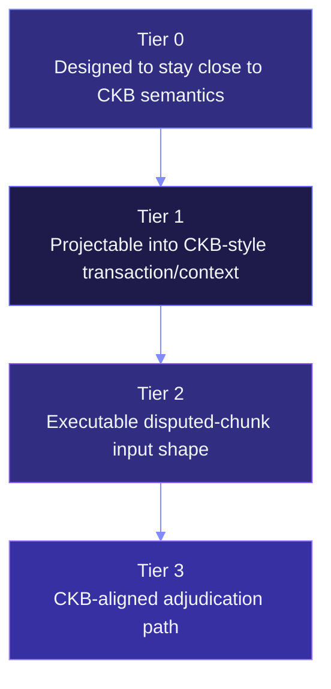

# Claim ladder

Every Myelin artefact has to climb a four-tier claim ladder. The
ladder is **deliberate**: each tier requires a specific report to
exist and to verify. Until a tier is reached, the corresponding
claim is not made.

This page walks the ladder once, top to bottom.

## The four tiers

```text
no projection report      -> designed to stay close to CKB semantics
successful projection     -> projectable into a CKB-style transaction/context
court bundle              -> executable disputed-chunk input shape
future exercised court    -> CKB-aligned adjudication path
```



## Tier 0 — Designed to stay close to CKB semantics

**Claim.** The runtime is designed to keep its transitions
Cell-shaped and CKB-compatible. No measurement, no projection —
just an architectural claim.

**Evidence.** This documentation. The architecture pages describe
the runtime's structure; the concept pages describe the CKB mental
model Myelin borrows from.

**Boundary.** Tier 0 is the floor. It is *not* sufficient to claim
CKB alignment; it's sufficient to claim that the design intends to
be CKB-aligned.

## Tier 1 — Projectable into a CKB-style transaction/context

**Claim.** A specific transition has been measured and projected;
the projection report either confirms `ckb_projection_possible: true`
or lists explicit deviation flags.

**Evidence.** A `MyelinExecutionReport` paired with a
`CkbProjectionReport`. The two together prove:

- The transition ran in Myelin's CKB-VM-style verifier with a
  measured cycle count and exit code.
- The transition is projectable into a CKB-style transaction with a
  deterministic CKB transaction hash.

**What it doesn't prove.** The transition is *projectable*, not
*projected*. The bytes haven't been submitted to CKB. The court
verifier hasn't replayed them. The projection is a proof-of-shape,
not a proof-of-validity on a live chain.

**How to reach it.** Run `cargo run -p myelin-cli -- celltx
simple-report` and check the output JSON has
`semantic_profile: "ckb-compatible"` and
`ckb_projection_possible: true`.

## Tier 2 — Executable disputed-chunk input shape

**Claim.** A specific disputed chunk has been packaged as a
self-contained input that a CKB-VM-style court verifier *could*
consume.

**Evidence.** A `court-bundle` JSON that re-verifies successfully:

```text
vm_profile            -> matches declared profile
spawn/ipc requirement -> consistent
payload_hash          -> matches chunk_payload
molecule_tx_hash      -> matches ckb_molecule_tx_bytes
projection_hashes     -> matches projection_report
challenge_payload_hash-> matches challenge_payload
signature_hashes      -> matches committee evidence
signer_ids            -> valid committee certificates
committee certificate -> quorum weight present
court_verifiable      -> single-chunk verification possible
semantic_profile      -> matches payload
ckb_projection_possible-> matches projection report
unsupported_features  -> listed correctly
semantic_deviation_flags -> listed correctly
l1_court_implemented  -> false (explicit)
challenge_window_consistent -> with settlement intent if present
```

(That's 16 distinct assertions; the verify command runs them all.)

**What it doesn't prove.** The CKB court verifier exists yet. Tier
2 is the *input shape* to that verifier — it's the artifact that
*would* be adjudicated, ready and waiting.

**How to reach it.** Run the session court-bundle commands:

```bash
myelin-cli session court-bundle  --session <commit>  --chunk-index 0  --out reports/bundle.json
myelin-cli session verify-court-bundle  --bundle reports/bundle.json  --out reports/verify.json
```

The verify report must report `valid: true` with all 16 assertions
passing.

## Tier 3 — CKB-aligned adjudication path

**Claim.** A CKB court verifier type script exists, is deployed on
a live CKB chain, and has actually replayed a bundle to a verdict.

**Evidence.** A CKB transaction hash on mainnet or testnet, with:

```text
court verifier type script deployed on the target chain
disputed chunk bundle submitted as input
on-chain verdict emitted (accept or slash)
slashed bond visible on chain
```

**What it doesn't prove (yet).** That Myelin is a permissionless
L2 in the public-validator sense. Tier 3 is the *adjudication* tier
— it's about whether disputes can be resolved on L1, not about who
can be a validator.

**How to reach it.** This requires:

1. A court verifier type script written in CellScript (or
   hand-rolled C/Rust).
2. The verifier deployed on CKB mainnet (or a testnet that counts
   for the claim).
3. A bundle submitted to the verifier.
4. The verifier emitting a verdict.

This is **future work**. The Myelin kernel can produce all the
inputs today; the L1 court path is what closes the loop. Until
then, every Myelin claim sits at Tier 2 or below.

## Where each Myelin artefact sits today

| Artefact | Tier | Why |
| --- | --- | --- |
| `simple-report.json` (trivial CellTx) | 1 | Has an execution report + projection report. |
| `session-court-bundle.json` + `verify-court-bundle.json` | 2 | All 16 assertions pass; bundle is self-contained. |
| `session-da-anchor-package.json` + `verify-da-anchor-package.json` | 2 (anchor) | Package is verified; submission is dry-run only. |
| `session-settlement-package.json` + `verify-settlement-package.json` | 2 (settlement) | Same as above for settlement. |
| Devnet smoke `myelin-ckb-devnet-smoke-v1` | 2 (with live CellTx execution) | Live carrier submissions on a parent CKB devnet, including tampered-carrier rejection. |
| Real CKB court verdict on mainnet | 3 | **Not yet.** Requires court verifier deployment. |

## The discipline

The ladder's discipline is simple:

- Don't claim a tier you haven't reached.
- Don't skip tiers; each one is built on the previous.
- Don't hide the boundary — every report carries explicit flags
  that say which tier it sits at.

The Myelin CLI's readiness reports are designed to make this hard
to fudge:

```text
readiness {
  semantic_profile:              "ckb-compatible"   // tier >= 1 if ckb-compatible
  ckb_projection_possible:       true               // tier >= 1
  l1_da_published:               false              // tier < 3 for DA claim
  l1_court_implemented:          false              // tier < 3 for court claim
  production_submission_ready:   false              // tier < 3 for end-to-end
  end_to_end_production_ready:   false
  production_blockers:           [...]              // explicit
}
```

Anyone who reads the report sees exactly which claims are
established and which aren't.

## Where to go next

- [Evidence paths](evidence-paths.md) — what each report actually
  proves.
- [Threat model](threat-model.md) — what's in scope and what's
  not for each tier.
- [L1 / L2 / off-chain interactions](../interactions/l1-l2-offchain.md)
  — the bigger picture.