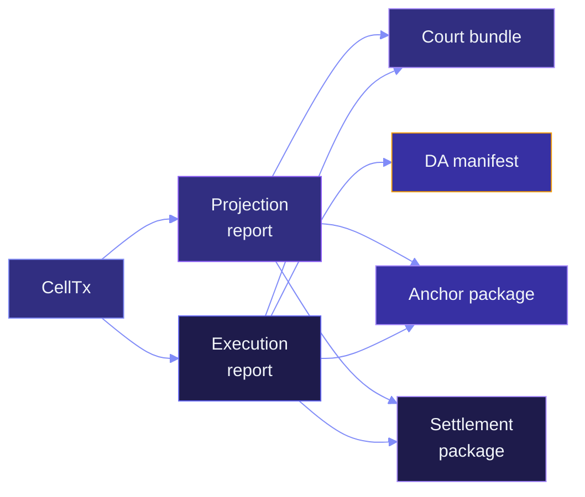
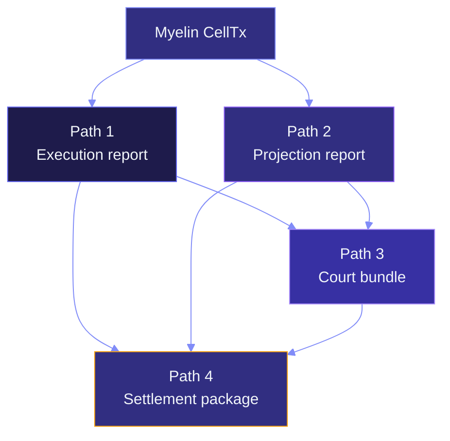

# Evidence paths

A **path** is a chain of artefacts that together prove a specific
claim. Myelin has four paths:

```text
execution     -> did the VM accept this transition?
projection    -> is it projectable into a CKB-style transaction?
court         -> is the disputed chunk adjudicable?
settlement    -> is the L1 closeable from a CKB CellTx?
```

This page walks each path: the artefacts it produces, what they
prove, and where the proof stops.

## Path 1 — Execution

**Goal.** Prove that a Myelin CellTx ran in the deterministic
verifier and produced a specific state-root transition.

**Artefacts.**

```text
MyelinExecutionReport
├── accepted            : bool
├── vm_exit_code        : i8
├── cycles              : u64
├── consumed_cells      : Vec<OutPoint>
├── created_cells       : Vec<CellOutput>
├── read_refs           : Vec<OutPoint>
├── witness_hashes      : Vec<[u8; 32]>
├── script_deps         : Vec<CellDep>
├── conflict_hashes     : Vec<[u8; 32]>
├── typed_data_hashes   : Vec<[u8; 32]>
├── scheduler_report_hash: [u8; 32]
├── state_root_before   : [u8; 32]
├── state_root_after    : [u8; 32]
└── semantic_profile    : SemanticProfile
```

**Proves.**

- The CellTx was admitted into Myelin's executor.
- The deterministic VM ran the script groups with the measured
  cycle count and exit code.
- The state-root transition matches the cell-level deltas.

**Does not prove.**

- The transition is valid on CKB. That's Path 2.
- The transition is disputable. That's Path 3.

**How it's used.** Every other path consumes the execution report.
If the execution report says `accepted: false`, the other paths
don't apply.

## Path 2 — Projection

**Goal.** Prove that the CellTx is projectable into a CKB-style
transaction/context without changing semantics.

**Artefacts.**

```text
CkbProjectionReport
├── projection_possible         : bool
├── ckb_style_tx_hash           : Option<[u8; 32]>
├── cell_inputs                 : Vec<OutPoint>
├── cell_outputs                : Vec<CellOutput>
├── cell_deps                   : Vec<CellDep>
├── witnesses                   : Vec<Vec<u8>>
├── script_groups               : Vec<ScriptGroup>
├── unsupported_features        : Vec<String>
└── semantic_deviation_flags    : Vec<String>
```

**Proves.**

- Every consumed Cell, produced Cell, dep, witness, and script
  group is Molecule-encodable.
- The CKB transaction hash is deterministic from the projected
  bytes.
- Any Myelin-only feature is listed explicitly in
  `unsupported_features`.

**Does not prove.**

- The projection has been submitted to CKB. That's Path 4.
- The projection has been adjudicated. That's Path 3.

**How it's used.** The court bundle, the anchor package, and the
settlement package all carry the projection report. The reader
can verify the report by re-running
`myelin-exec::projection::project_celltx`.



## Path 3 — Court

**Goal.** Prove that a specific disputed chunk is adjudicable.

**Artefacts.**

```text
court_bundle
├── chunk_payload               : Vec<u8>
├── chunk_payload_hash           : [u8; 32]
├── ckb_molecule_tx_bytes        : Vec<u8>
├── ckb_molecule_tx_hash         : [u8; 32]
├── projection_report            : CkbProjectionReport
├── challenge_payload            : Vec<u8>
├── challenge_payload_hash       : [u8; 32]
├── scheduler_report_hash        : [u8; 32]
└── committee_certificate        : CommitteeCertificate

court_verify
├── valid        : bool
└── assertions   : Vec<{ name, ok, detail }>
```

**Proves.**

- The bundle is self-contained: payload, projected Molecule tx,
  projection report, challenge payload, committee certificate,
  scheduler report hash.
- All 16 verify assertions pass (vm_profile, hashes, signatures,
  certificate shape, etc.).

**Does not prove.**

- The CKB court verifier has actually replayed it. That's Tier 3.
- The disputed chunk is invalid. The court bundle is the
  *input*; the verdict is the output.

**How it's used.** The settlement intent binds to the verified
court bundle. The settlement package binds to the verified intent.
See [Court path](../interactions/court-path.md).

## Path 4 — Settlement

**Goal.** Prove that an L1 close is possible from a CKB CellTx.

**Artefacts.**

```text
settlement_intent
├── kind                    : "disputed-close"
├── session_id              : [u8; 32]
├── chunk_index             : u64
├── court_bundle_hash       : [u8; 32]
├── da_manifest_hash        : [u8; 32]
├── challenge_window_ms     : u64
├── current_time_ms         : u64
├── court_economics         : CourtEconomics
├── l1_da_published         : bool
└── l1_court_implemented    : bool

settlement_package
├── settlement_intent_hash  : [u8; 32]
├── ckb_molecule_tx_bytes   : Vec<u8>
├── ckb_molecule_tx_hash    : [u8; 32]
├── cell_inputs             : Vec<OutPoint>
├── cell_outputs            : Vec<CellOutput>
├── cell_deps               : Vec<CellDep>
├── witnesses               : Vec<Vec<u8>>
├── projection_report       : CkbProjectionReport
├── court_economics_commitment : [u8; 32]
└── authority_attestation   : AuthorityAttestation
```

**Proves.**

- The intent is a permitted close (challenge window elapsed,
  dispute bundle verified, DA manifest verified).
- The package encodes the intent as a CKB-compatible CellTx.
- The CellTx has the projected Molecule bytes and the same
  CellTx commitments as the verified intent.
- Authority attestation (if present) binds the package to a
  threshold-lock enforced authority Cell.

**Does not prove.**

- The CellTx has been submitted to CKB. That's the submission
  path.
- The CellTx has been committed. That's the readiness chain.

**How it's used.** The submission path runs through the
`session submit-settlement-package` command (dry-run by default)
and then through the five-step readiness chain.

## How the four paths compose



Path 1 and Path 2 run independently off the same CellTx. Path 3
consumes both. Path 4 consumes all three (plus the DA manifest,
which is its own side path).

## The five readiness flags

The aggregate readiness report carries five flags that summarise
the claim level across paths:

```text
production_submission_ready        -> bool
final_l1_script_submission_ready   -> bool
end_to_end_production_ready        -> bool
end_to_end_production_blockers     -> Vec<String>
```

Each path contributes its evidence; the aggregate combines them.
See [Claim ladder](claim-ladder.md) for what each tier requires.

## What a path doesn't cover

- **Trust assumptions.** The committee is trusted; the path doesn't
  re-verify committee honesty.
- **Liveness.** The path doesn't prove the chain is making progress.
- **Censorship resistance.** The path doesn't prove a producer can
  always get a transaction through.
- **Economic finality.** The path doesn't put a number on "how much
  would it cost to revert this?" — that's a slashing-economics
  question, and there's no slashing in the current design.

Those are outside the current path scope. See
[Threat model](threat-model.md).

## Where to go next

- [Threat model](threat-model.md) — what's in scope and what's
  not.
- [Claim ladder](claim-ladder.md) — the tier each path reaches.
- [L1 submission flow](../interactions/submission-flow.md) — the
  final readiness chain.