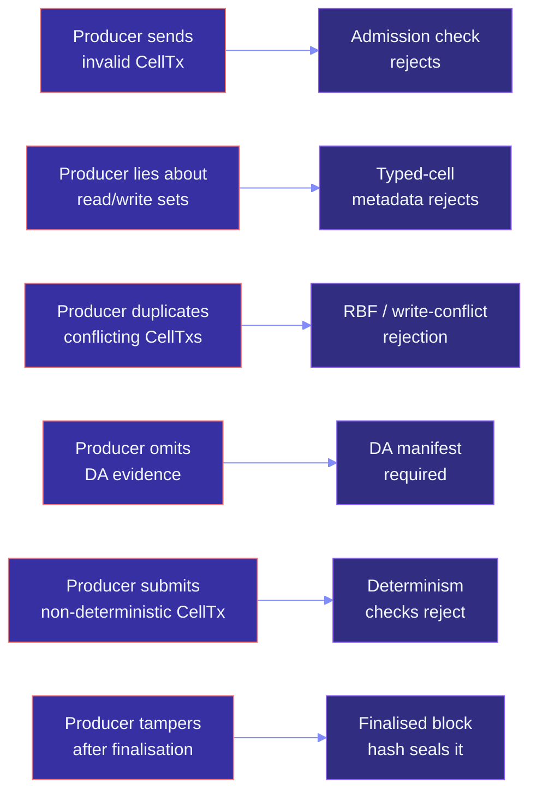
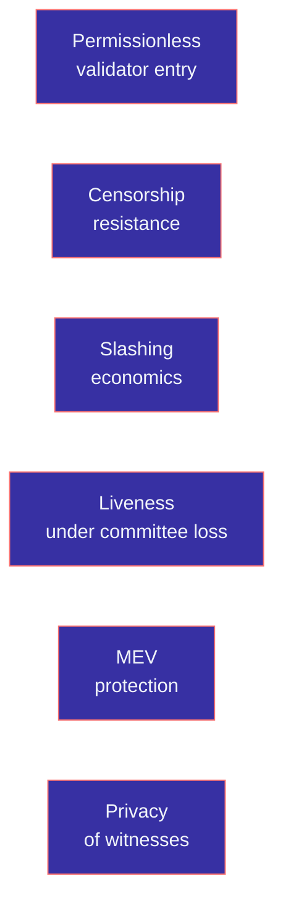

# Threat model

This page is the honest list of what Myelin protects against today,
what it explicitly does not protect against, and what's outside
scope. It's deliberately conservative: every claim that *isn't* in
the "in scope" list should be assumed to be out of scope.

## In scope — what Myelin protects against



| Threat | How Myelin handles it |
| --- | --- |
| **Producer sends an invalid CellTx** | The admission check rejects it on metadata shape; the VM rejects it on exit code. Either way, the CellTx never enters a finalised block. |
| **Producer lies about read/write sets** | The typed-cell metadata commits to the conflict hash at compile time. The scheduler rejects CellTxs whose actual read/write sets don't match the metadata. |
| **Producer duplicates conflicting CellTxs** | The mempool's RBF rules apply; conflicting CellTxs in the same domain are rejected. |
| **Producer omits DA evidence** | The DA manifest is required for the readiness ladder to reach `production_submission_ready`. Without it, the submission chain refuses to mark the package as production-ready. |
| **Producer submits non-deterministic CellTx** | The runtime rejects non-deterministic execution paths (wall-clock reads, FP non-determinism, etc.) at admission and at execution. |
| **Producer tampers after finalisation** | The committee certificate signs the canonical block hash. Tampering with any field changes the hash and invalidates the certificate. |

## In scope — committee-level guarantees

For the L2 fast path, Myelin trusts the configured committee to:

| Property | What it means |
| --- | --- |
| **Honesty** | A quorum of committee members signs only blocks they have verified. |
| **Availability** | A quorum of committee members is online to finalise blocks. |
| **Determinism** | All committee members compute the same block hash from the same input. |

These are **trust assumptions**, not cryptographic guarantees. The
trust model is direct: you trust the configured validators. If you
don't trust them, the projection + court path is your recourse.

## What the projection layer protects

The projection layer protects against a producer who *claims* a
transition is CKB-aligned when it isn't:

```text
if the projection report says projection_possible: true
   the CellTx is projectable; the court can replay it

if the projection report says projection_possible: false
   the report lists the explicit deviation flags

if the projection report doesn't exist
   the transition makes no CKB-alignment claim
```

A producer who tries to claim CKB-alignment for a non-projectable
CellTx will be caught by any reader who runs the projection layer
themselves. The deterministic `ckb_style_tx_hash` makes this check
trivial.

## What the future court protects against

When the CKB court verifier is implemented and deployed, the
court protects against:

| Threat | How the court handles it |
| --- | --- |
| **A committee that signs an invalid block** | A disputer submits a court bundle; the court replays the chunk and compares the state root. Mismatch → slash. |
| **A producer who tampers with the chunk payload** | The DA manifest seals the payload; the anchor CellTx anchors it on L1. Tampering is detectable from the manifest. |
| **A committee that refuses to sign a valid block** | The court's accept verdict is the proof that the block was valid; the producer can escalate. |

These are the threats the future court path is designed for. They
are not protected against *today* — the court verifier is not yet
implemented.

## Out of scope — what Myelin does NOT protect against



| Out of scope | Why |
| --- | --- |
| **Permissionless validator entry** | Both consensus engines assume a known validator set. Adding open entry requires staking, slashing, identity, and a different engine. |
| **Censorship resistance** | The committee is trusted; a malicious committee can refuse to include CellTxs. The L1 court path doesn't help here. |
| **Slashing economics** | There is no stake to slash in the current design. The trust model is direct. |
| **Liveness under committee loss** | If more than the quorum is offline, no blocks are finalised. The protocol doesn't have a fallback finality. |
| **MEV protection** | The committee can reorder CellTxs in the parallel batches. The ordering rule is deterministic, but the rule isn't MEV-resistant. |
| **Privacy of witnesses** | Witnesses are visible to the committee. Encryption is not part of the current design. |

These are deliberate scope choices. Each one would require its
own design work, its own audit, and its own evidence path. They
are not "missing features" — they are "outside the current
protocol."

## Out of scope — what Myelin doesn't try to be

| Out of scope | Why |
| --- | --- |
| **A CKB full-node fork** | Myelin does not import or sync the CKB client. |
| **A new L1** | Myelin does not run its own consensus on a separate chain. |
| **A general smart-contract platform** | Myelin optimises for bounded sessions that produce challengeable settlement artefacts. |
| **A microsecond matching engine** | Sub-millisecond matching is outside the protocol design. |
| **A global public order book** | The committee-based finality is not aimed at global permissionless matching. |

These are about what Myelin **is**, not what Myelin **isn't doing
yet**. See [What is Myelin?](../concepts/what-is-myelin.md) for
the full positioning.

## The honest disclaimer

Myelin is **experimental protocol software**. The current public
claim is:

```text
Myelin currently uses selectable closed-validator finality for session
benchmarking and pressure testing. The CKB-style projection and future
court path is what keeps it aligned with CKB semantics.
```

The closed-validator finality is not a permissionless security
claim. The CKB-style projection is a proof-of-shape, not a
proof-of-validity on a live chain. The future court path is future
work.

Use the evidence paths and the claim ladder to figure out what
*your* deployment can rely on. Don't market Myelin past the
boundary.

## Where to go next

- [Claim ladder](claim-ladder.md) — the tier each piece of evidence
  reaches.
- [Evidence paths](evidence-paths.md) — the four paths and what
  each one proves.
- [What is Myelin?](../concepts/what-is-myelin.md) — the
  positioning.