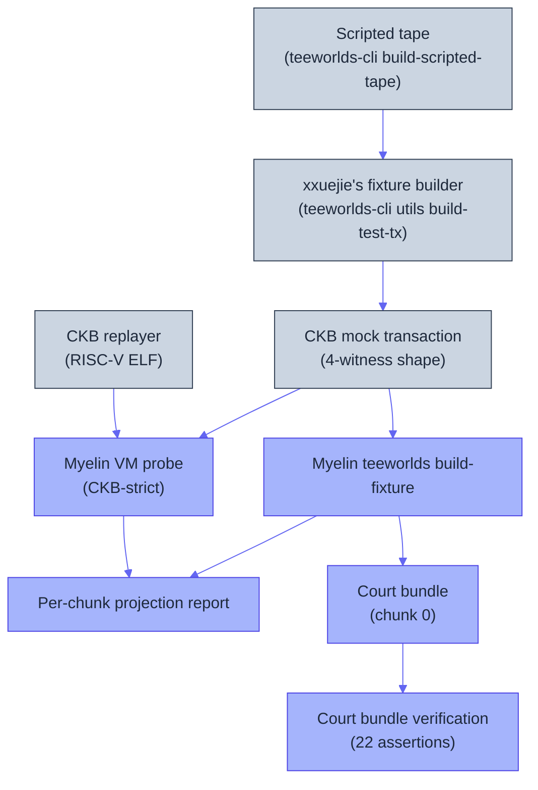

# Teeworlds end-to-end runbook

This is the canonical end-to-end demo for the Myelin runtime. By the end you
will have run a real CKB-VM binary (xxuejie's Teeworlds replayer) through
Myelin's verifier, chunked the game tape, projected each chunk to a
CKB-style transaction, and produced a court bundle ready for the future
dispute verifier.

The whole path is **local** — it needs no running CKB node, no L1, and no
network. It is the most comprehensive evidence Myelin ships today.

## What you'll produce

| Artefact | Where | What it proves |
| --- | --- | --- |
| `scripted-tape.bin` | `OUTPUT_DIR` | A deterministic 2162-byte game tape (no live game needed). |
| `teeworlds-mock-tx.json` | `OUTPUT_DIR` | A CKB mock transaction with the 4-witness shape the replayer expects. |
| `build-fixture.json` | `OUTPUT_DIR` | Per-chunk CellTx reports with CKB projection status + a benchmark block. |
| `vm-probe.json` | `OUTPUT_DIR` | The replayer run through Myelin's CKB-strict VM — cycle count, exit code. |
| `court-bundle.json` | `OUTPUT_DIR` | A disputed-chunk court input bundle. |
| `court-bundle-verify.json` | `OUTPUT_DIR` | `valid: true` with all checks passing. |

`OUTPUT_DIR` defaults to `/tmp/myelin-teeworlds-acceptance`.

## What we're exercising



Every box is a real step. Every arrow is a real CLI invocation.

## Prerequisites

You need the Myelin workspace installed per
[Install the toolchain](../getting-started/install.md), **and** xxuejie's
Teeworlds fork with its RISC-V replayer built. The canonical pin is:

- Repo: `https://github.com/xxuejie/teeworlds` (the "Teeworlds on CKB" fork —
  **not** the official `teeworlds/teeworlds` game repo, which lacks the
  `ckb/` replayer build path).
- Commit: `f77e39e5fa5bfa0b4831d8d6d7c4690183807a29` ("Add steps to run the
  demo", 2026-06-16).

### Clone and build the replayer

```bash
# Clone the fork at the pinned commit.
git clone https://github.com/xxuejie/teeworlds "$HOME/RustroverProjects/teeworlds"
cd "$HOME/RustroverProjects/teeworlds"
git checkout f77e39e5fa5bfa0b4831d8d6d7c4690183807a29
git submodule update --init --recursive

# Build the game + fixture tooling (produces teeworlds-cli and the map/config).
cmake -S . -B build && cmake --build build --target teeworlds_replayer -j4

# Build the RISC-V replayer ELF (needs clang/ld.lld from Homebrew LLVM).
cd ckb
PATH="/opt/homebrew/opt/llvm/bin:$PATH" make CLANG=/opt/homebrew/opt/llvm/bin/clang LD=/opt/homebrew/bin/ld.lld
cd ..
```

This produces:

- `ckb/build/replayer_stripped` — the RISC-V ELF that runs in CKB-VM.
- `build/data/maps/dm1.map` — the game map.
- `build/myelin_replay_40265.cfg` — the replay config.
- `rust-tools/` — the `teeworlds-cli` fixture builder.

> [!NOTE]
> The replayer is built by the teeworlds repo's own `ckb/Makefile` using
> clang/ld.lld — it is **not** a `cargo build --target riscv...` invocation.

If anything is missing, the doctor tells you exactly what's not ready:

```bash
cargo run -p myelin-cli -- teeworlds doctor \
  --teeworlds-root "$HOME/RustroverProjects/teeworlds" \
  --out reports/teeworlds-doctor.json
```

A ready environment reports `ready_for_myelin_vm_probe: true` with all nine
paths and nine tools present and `notes: []`.

## Step 1 — Run the whole acceptance gate

The fastest path is the single acceptance script, which runs every step
below in order and asserts the evidence:

```bash
scripts/myelin_teeworlds_acceptance.sh
```

It honours these env vars (all optional):

| Var | Default | Meaning |
| --- | --- | --- |
| `TEEWORLDS_ROOT` | `$HOME/RustroverProjects/teeworlds` | Path to the clone. |
| `OUTPUT_DIR` | `/tmp/myelin-teeworlds-acceptance` | Where JSON reports land. |
| `TICKS` / `CLIENTS` / `INPUT_EVERY` / `SEED` | `300` / `1` / `5` / `1` | Scripted-tape shape. |
| `CHUNK_BYTES` | `262144` | Chunk size. |
| `MAX_CYCLES` | `70000000` | VM cycle budget. |

A passing run prints a summary whose live values (recorded 2026-07) are:

```json
{
  "tape_bytes": 2162,
  "fixture_chunks": 1,
  "vm_cycles": 15139695,
  "vm_profile": "ckb-strict-basic",
  "ckb_spawn_ipc_enabled": false,
  "court_checks": 22,
  "semantic_profile": "ckb-compatible",
  "static_committee_finalised": true
}
```

The remaining steps show what the script does internally, in case you want
to run them individually.

## Step 2 — Generate a scripted tape

The replayer does not need a live game session — a deterministic scripted
tape is enough to exercise the witness wiring, map/config loading, and the
replay loop.

```bash
cargo run --manifest-path "$TEEWORLDS_ROOT/rust-tools/Cargo.toml" \
  --bin teeworlds-cli -- utils build-scripted-tape \
  --ticks 300 --clients 1 --input-every 5 --seed 1 \
  --output /tmp/myelin-teeworlds-acceptance/scripted-tape.bin
```

Expected output: `2162 bytes, 300 ticks, 1 clients`. Replaying it twice
yields the same final-state CRC because the replayer is deterministic.

## Step 3 — Build the CKB mock transaction

The fixture builder wraps the tape + map + config into a CKB mock
transaction with the four-witness shape Myelin expects:

```bash
cargo run -p myelin-cli -- teeworlds build-fixture \
  --teeworlds-root "$TEEWORLDS_ROOT" \
  --replayer "$TEEWORLDS_ROOT/ckb/build/replayer_stripped" \
  --tape /tmp/myelin-teeworlds-acceptance/scripted-tape.bin \
  --map "$TEEWORLDS_ROOT/build/data/maps/dm1.map" \
  --config "$TEEWORLDS_ROOT/build/myelin_replay_40265.cfg" \
  --mock-tx-output /tmp/myelin-teeworlds-acceptance/teeworlds-mock-tx.json \
  --chunk-bytes 262144 --runs 3 \
  --out /tmp/myelin-teeworlds-acceptance/build-fixture.json
```

The mock transaction's witness slots are fixed by contract:

```text
witness[0] -> signature witness (placeholder)
witness[1] -> tape (game events)
witness[2] -> map (game world geometry)
witness[3] -> config (game rules)
```

## Step 4 — Run the VM probe

The VM probe constructs the witness layout and runs the replayer binary as
a type-script group through Myelin's CKB-VM verifier:

```bash
cargo run -p myelin-cli -- teeworlds vm-probe \
  --replayer "$TEEWORLDS_ROOT/ckb/build/replayer_stripped" \
  --tape /tmp/myelin-teeworlds-acceptance/scripted-tape.bin \
  --map "$TEEWORLDS_ROOT/build/data/maps/dm1.map" \
  --config "$TEEWORLDS_ROOT/build/myelin_replay_40265.cfg" \
  --max-cycles 70000000 \
  --out /tmp/myelin-teeworlds-acceptance/vm-probe.json
```

Expected `vm-probe.json`:

```json
{
  "replayer": ".../ckb/build/replayer_stripped",
  "tape_bytes": 2162,
  "map_bytes": 6793,
  "config_bytes": 83,
  "max_cycles": 70000000,
  "vm_profile": "ckb-strict-basic",
  "ckb_strict": true,
  "ckb_spawn_ipc_enabled": false,
  "success": true,
  "cycles": 15139695,
  "error": null
}
```

## Step 5 — Build and verify a court bundle

Take chunk `0` of the fixture and package it for the future court:

```bash
cargo run -p myelin-cli -- teeworlds court-bundle \
  --mock-tx /tmp/myelin-teeworlds-acceptance/teeworlds-mock-tx.json \
  --chunk-bytes 262144 --chunk-index 0 \
  --out /tmp/myelin-teeworlds-acceptance/court-bundle.json

cargo run -p myelin-cli -- teeworlds verify-court-bundle \
  --bundle /tmp/myelin-teeworlds-acceptance/court-bundle.json \
  --out /tmp/myelin-teeworlds-acceptance/court-bundle-verify.json
```

The verify command runs **22** distinct assertions against the bundle (six
data-binding checks were added in the hardening pass, raising the count
from 14 to 22). If it reports `valid: true` with all checks passing, you've
reached Tier 2 of the claim ladder: *"executable disputed-chunk input
shape."*

## Step 6 — (Optional) Tendermint path and merged repro report

The same workload finalises under the Tendermint precommit verifier too.
`build-fixture`, `court-bundle`, and `verify-court-bundle` all accept a
`--consensus tendermint` flag. The merged static + Tendermint repro report
is produced by:

```bash
python3 scripts/build_myelin_teeworlds_repro.py
# -> writes reports/myelin-teeworlds-repro.json (not committed; carries local paths)
```

Its `shared_metrics` match the static summary:

```json
{
  "tape_bytes": 2162,
  "vm_cycles": 15139695,
  "projection_status": "ckb-compatible",
  "court_bundle_status": "valid"
}
```

## What this proves

- ✅ A real CKB binary ran through Myelin's CKB-strict VM (15,139,695 cycles).
- ✅ Per-chunk projection reports all say `ckb-compatible`.
- ✅ A court bundle exists, with all 22 assertions passing.
- ✅ The workload finalises under both the static closed committee and the
  Tendermint precommit verifier.

It does **not** exercise (yet):

- A live gameplay tape (network + GUI + sequencer dump).
- Permissionless validator entry.
- The on-chain court verifier (which is not yet implemented).

## Where to go next

- [First run](../getting-started/first-run.md) — the zero-dependency session
  demo (no teeworlds clone required).
- [Production gate](../operations/production-gate.md) — the broader gate that
  includes this path.
- [Concurrency plan](../operations/concurrency-optimization-plan.md) — where
  the CellDAG + parallel VM verification path (exercised by
  `session commit-multi`) fits.
- [Local CKB devnet smoke](../operations/devnet-smoke.md) — the live chain path.
