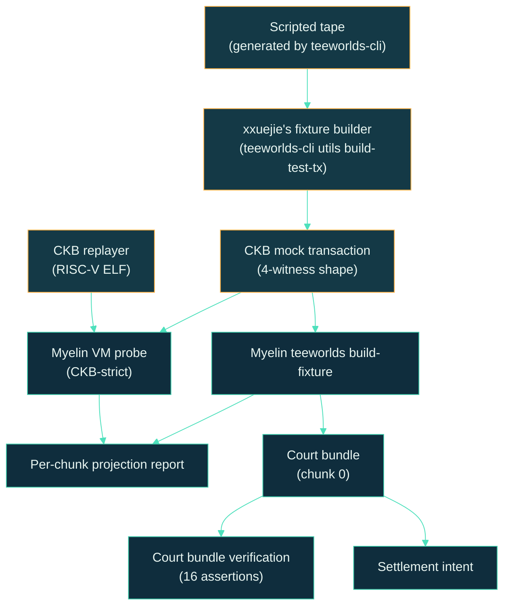

# Tutorial: Teeworlds end-to-end

This tutorial walks the full reference workload — the one Myelin
treats as the canonical pressure test. By the end you'll have run
xxuejie's CKB replayer binary through Myelin's VM, chunked the
game tape, projected each chunk to CKB, and produced a court
bundle ready for the future dispute verifier.

## What we're exercising



Every box is a real step. Every arrow is a real CLI invocation.

## Prerequisites

- The Myelin workspace installed per
  [Install the toolchain](../getting-started/install.md).
- The Teeworlds checkout parented at
  `$HOME/RustroverProjects/teeworlds` (see the parent
  `MYELIN_ARCHITECTURE.md` for the structure).
- A built `ckb/build/replayer_stripped` RISC-V ELF in the Teeworlds
  checkout.

If anything is missing, `myelin-cli teeworlds doctor` will tell you
exactly what's not ready:

```bash
cargo run -p myelin-cli -- teeworlds doctor \
  --teeworlds-root $HOME/RustroverProjects/teeworlds \
  --out reports/teeworlds-doctor.json
```

## Step 1 — Generate a scripted tape

The replayer doesn't need a live game session — a deterministic
scripted tape with the right shape (connect, enter, input, tick,
replay) is enough to exercise the witness wiring, the map/config
loading, and the replay loop.

```bash
cargo run --bin teeworlds-cli -- utils build-scripted-tape \
  --ticks 300 \
  --clients 1 \
  --input-every 5 \
  --seed 1 \
  --output /tmp/myelin-teeworlds-scripted-tape.bin
```

The tape is a deterministic sequence of game events. Replaying it
twice produces the same final state CRC, because the replayer is
deterministic.

## Step 2 — Build the CKB mock transaction

xxuejie's fixture builder takes the tape + map + config and emits
a CKB mock transaction with the four-witness shape Myelin expects:

```bash
cargo run --bin teeworlds-cli -- utils build-test-tx \
  --replayer $HOME/RustroverProjects/teeworlds/ckb/build/replayer_stripped \
  --tape /tmp/myelin-teeworlds-scripted-tape.bin \
  --map $HOME/RustroverProjects/teeworlds/build/data/maps/dm1.map \
  --config $HOME/RustroverProjects/teeworlds/build/myelin_replay_40265.cfg \
  --output /tmp/myelin-teeworlds-scripted-mock-tx.json
```

The mock transaction has:

```text
witness[0] -> signature witness (placeholder)
witness[1] -> tape (game events)
witness[2] -> map (game world geometry)
witness[3] -> config (game rules)
```

The slot numbers are part of the contract; the replayer reads them
at fixed positions.

## Step 3 — Build the Myelin fixture

The `teeworlds build-fixture` command ingests the mock
transaction, chunks the tape, emits per-chunk CellTx reports with
projection status, benchmarks the run, and finalises a
static-committee benchmark block:

```bash
cargo run -p myelin-cli -- teeworlds build-fixture \
  --teeworlds-root $HOME/RustroverProjects/teeworlds \
  --replayer $HOME/RustroverProjects/teeworlds/ckb/build/replayer_stripped \
  --tape /tmp/myelin-teeworlds-scripted-tape.bin \
  --map $HOME/RustroverProjects/teeworlds/build/data/maps/dm1.map \
  --config $HOME/RustroverProjects/teeworlds/build/myelin_replay_40265.cfg \
  --mock-tx-output /tmp/myelin-teeworlds-scripted-mock-tx.json \
  --runs 3 \
  --out reports/teeworlds-build-fixture.json
```

What's inside the JSON:

```text
workload                          : "teeworlds"
source_repo                       : "$HOME/RustroverProjects/teeworlds"
mode                              : "ckb-style-fixture"
tape_size_bytes                   : 4096
chunk_size_bytes                  : 262144
vm_cycles                         : measured for each run
execution_latency_ms              : measured
scheduler_overhead_ms             : measured
committee_finalisation_latency_ms : measured
semantic_profile                  : "ckb-compatible"
ckb_projection_possible           : true
```

No expected numbers are hard-coded. The benchmark records what was
measured, and the report says whether each chunk projects.

## Step 4 — Run the VM probe

The VM probe constructs the witness layout and runs the replayer
binary as a type-script group through Myelin's CKB-VM verifier:

```bash
cargo run -p myelin-cli -- teeworlds vm-probe \
  --replayer $HOME/RustroverProjects/teeworlds/ckb/build/replayer_stripped \
  --tape /tmp/myelin-teeworlds-scripted-tape.bin \
  --map $HOME/RustroverProjects/teeworlds/build/data/maps/dm1.map \
  --config $HOME/RustroverProjects/teeworlds/build/myelin_replay_40265.cfg \
  --max-cycles 70000000 \
  --out reports/teeworlds-vm-probe.json
```

The probe models the replayer's CKB witness contract with input
witness slots `1 = tape`, `2 = map`, `3 = config`, exactly as the
replayer expects.

If the probe runs cleanly, the JSON reports:

```text
vm_exit_code         : 0
cycles               : <measured>
semantic_profile     : "ckb-compatible"
vm_profile           : "ckb-strict-basic"
ckb_spawn_ipc_required : false
court_verifiable     : true
projection_possible  : true
```

A live gameplay tape (vs the scripted one we're using here) would
produce the same shape, just with more cycles and longer
execution_latency_ms.

## Step 5 — Build a court bundle

Take chunk `0` of the fixture and package it for the future court:

```bash
cargo run -p myelin-cli -- teeworlds court-bundle \
  --mock-tx /tmp/myelin-teeworlds-scripted-mock-tx.json \
  --chunk-bytes 262144 \
  --chunk-index 0 \
  --out reports/teeworlds-court-bundle.json

cargo run -p myelin-cli -- teeworlds verify-court-bundle \
  --bundle reports/teeworlds-court-bundle.json \
  --out reports/teeworlds-court-bundle-verify.json
```

The verify command runs 16 distinct assertions against the bundle.
If it reports `valid: true` with all 16 passing, you've reached
**Tier 2** of the claim ladder: *"executable disputed-chunk input
shape."*

## Step 6 — Run the acceptance gate

If you want to do all of this in one shot:

```bash
scripts/myelin_teeworlds_acceptance.sh
```

The script:

1. Regenerates the scripted tape.
2. Invokes xxuejie's fixture builder.
3. Runs Myelin build-fixture, VM probe, court-bundle, and
   court-bundle verification.
4. Asserts every JSON output is `ckb-compatible`,
   `projection_possible: true`, `vm_profile: ckb-strict-basic`,
   `court_verifiable: true`, and finalised by the static
   committee.

A passing acceptance gate means:

- ✅ A real CKB binary ran through Myelin's CKB-strict VM.
- ✅ Per-chunk projection reports all say `ckb-compatible`.
- ✅ A court bundle exists, with all 16 assertions passing.
- ⚠ Live gameplay tape and CKB mainnet court verifier remain
  next-step work.

## What this proves

The end-to-end Teeworlds path is the most comprehensive evidence
Myelin has today. It exercises:

- CellScript source → typed-cell metadata → CellTx.
- CKB-VM-style verifier with a real RISC-V binary.
- Molecule encoding throughout.
- Per-chunk projection reports.
- Court bundle construction and verification.
- Static-committee finality.

It does **not** exercise (yet):

- A live gameplay tape (network + GUI + sequencer dump).
- Permissionless validator entry.
- The on-chain court verifier (which is not yet implemented).

## Where to go next

- [Production gate](../operations/production-gate.md) — the
  broader gate that includes this path.
- [Local CKB devnet smoke](../operations/devnet-smoke.md) — the
  live chain path.
- [Court path](../interactions/court-path.md) — the deeper
  walk-through of the bundle shape.